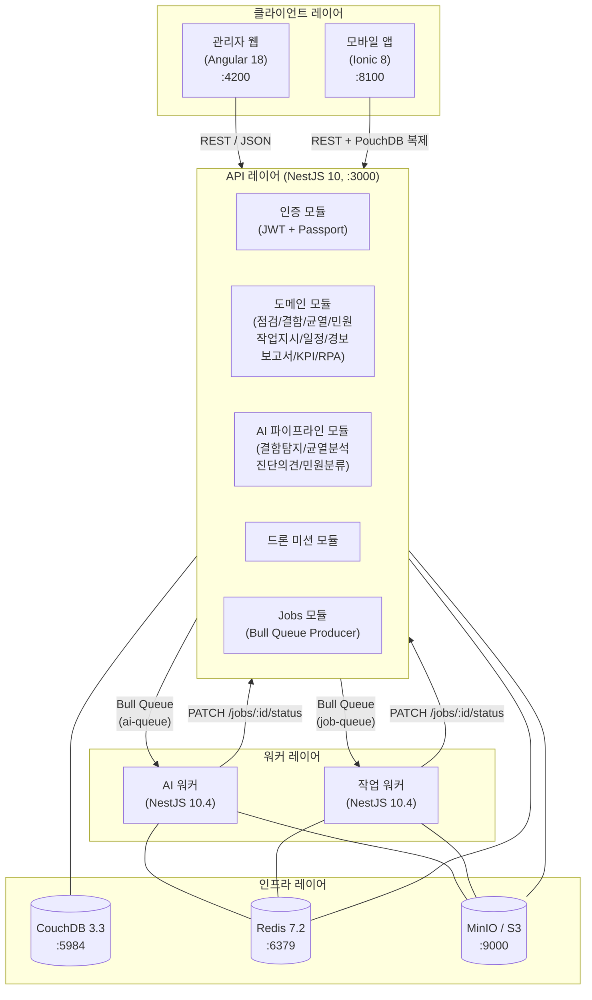
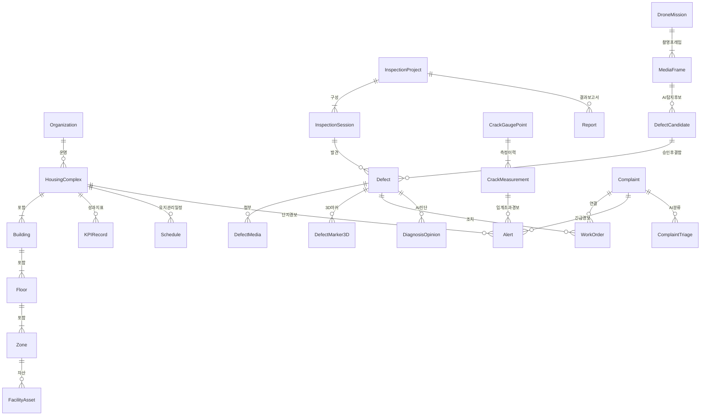
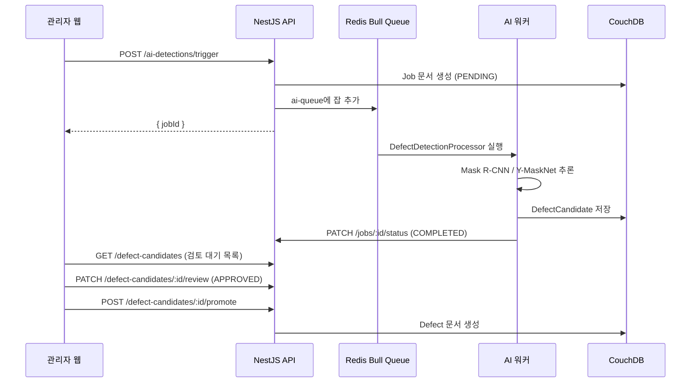

# AX 공공임대주택 안전관리 플랫폼

> **에이톰엔지니어링** | AI·드론·RPA 융합 공공임대주택 시설물 안전관리 SaaS  
> 국토교통부 「AI 응용제품 신속 상용화 지원사업(AX-SPRINT)」 Agile 트랙 과제

[](https://nestjs.com)
[](https://angular.io)
[](https://couchdb.apache.org)
[](https://www.typescriptlang.org)
[](https://redis.io)
[](https://www.docker.com)

---

## 목차

1. [사업 개요](#1-사업-개요)
2. [문제 정의 및 솔루션](#2-문제-정의-및-솔루션)
3. [플랫폼 주요 기능](#3-플랫폼-주요-기능)
4. [시스템 아키텍처](#4-시스템-아키텍처)
5. [기술 스택](#5-기술-스택)
6. [프로젝트 구조](#6-프로젝트-구조)
7. [빠른 시작 (Docker)](#7-빠른-시작-docker)
8. [환경 변수](#8-환경-변수)
9. [샘플 데이터 세딩](#9-샘플-데이터-세딩)
10. [주요 명령어](#10-주요-명령어)
11. [API 명세](#11-api-명세)
12. [계정 정보 (데모)](#12-계정-정보-데모)
13. [외부 접속 (Cloudflare Tunnel)](#13-외부-접속-cloudflare-tunnel)
14. [비즈니스 로직 완전 해설](#14-비즈니스-로직-완전-해설)
15. [Phase 2 완료 현황 & Phase 3 백로그](#15-phase-2-완료-현황--phase-3-백로그)
16. [Render.com 배포](#16-rendercom-배포)
17. [문서 인덱스](#17-문서-인덱스)
18. [버전 히스토리](#18-버전-히스토리)

---

## 1. 사업 개요

| 항목 | 내용 |
|------|------|
| **사업명** | AX 기반 공공임대주택 시설물 안전유지관리 최적화 및 지능형 행정자동화 솔루션 상용화 |
| **근거 공고** | 국토교통부 「AI 응용제품 신속 상용화 지원사업(AX-SPRINT)」 Agile 트랙 |
| **주관기관** | 에이톰엔지니어링 |
| **협력기관** | SH서울주택도시공사, 한국건설기술연구원(KICT) |
| **기술성숙도** | TRL 8 — 실환경 시제품 성능평가 완료 |

---

## 2. 문제 정의 및 솔루션

### AS-IS: 공급자 중심 관리의 한계

| 문제 영역 | 현황 | 비효율 |
|-----------|------|--------|
| 점검 업무 | 수기 기록 → 사무소 수동 입력 | 중복·대기·이동 시간 60% 낭비 |
| 균열 모니터링 | 전문가 현장 방문 필수 | 원격 실시간 감시 불가 |
| 민원 처리 | 담당자 배정·이력 추적 수단 부재 | 평균 처리 8개월 소요 |
| 결함 기록 | 2D 도면에만 표시 | 높이(Z축) 정보 손실, 위치 재확인 어려움 |
| 고지서·통보 | 직원 수작업 발송 | 오발송·지연 상시 발생, 1인당 관리 708세대 |

**핵심 수치:** 경북개발공사 23개 시군 8,500세대 / 직원 12명 → 1인당 관리 708세대 (업계 기준 250~300세대의 2.5배)

### TO-BE: 디지털 전환 솔루션

| 솔루션 | 기술 | 기대 효과 |
|--------|------|-----------|
| AI 현장점검 10단계 자동화 | 신뢰도 점수 + KCS 기준 자동 대조 | 점검 업무 시간 **50% 단축** |
| 드론·비전 AI 정밀진단 | Y-MaskNet, Mask R-CNN | **0.2mm** 이하 균열 탐지 |
| RPA 행정자동화 | Bull Queue + 이메일/SMS 발송 | 고지서·만료 통보 **70~100% 자동화** |
| 균열 실시간 모니터링 | 게이지 포인트 + 임계치 경보 | 사전 예방 정비 체계 전환 |
| KICT 기준 XAI 보고서 | Puppeteer PDF 자동 생성 | 민원 처리 **8개월 → 2주 이내** |
| 3D 결함 시각화 | Three.js glTF 모델 + 위치 마커 | Z축 포함 3차원 결함 위치 기록 |

---

## 3. 플랫폼 주요 기능

### 관리자 웹 (admin-web)

| 기능 | 설명 |
|------|------|
| **운영 대시보드** | 활성 경보·결함·민원·균열 KPI 실시간 요약, 결함 유형 분포 차트 |
| **점검 프로젝트 관리** | 정기·긴급·특별 점검 프로젝트 생성, 세션 할당, 상태 워크플로우 |
| **균열 모니터링** | 게이지 포인트 등록·조회, 측정 이력 시계열 분석, 임계치 초과 경보 |
| **민원 관리** | 민원 접수·분류·배정·처리·종결 워크플로우, 상태별 현황 카드 |
| **결함 관리** | 결함 등록·심각도 분류·수리 이력 추적 |
| **경보 관리** | 균열 임계치·점검 지연·긴급 결함 경보 확인·처리 |
| **작업지시** | 결함·민원 연계 작업지시 생성·배정·완료 처리 |
| **KPI 분석** | 월별 점검 완료율·민원 해결률·예방정비 절감 추산 |
| **보고서** | 점검결과·결함목록·균열추세·XAI 평가 보고서 생성 |
| **단지/건물 관리** | 단지·동·층·구역 계층 구조 관리 |
| **자동화 관리 (Phase 2)** | RPA 룰 빌더, 실행 이력 모니터링, 즉시 실행 트리거 |
| **AI 검토 수신함** ★ | 전 AI 파이프라인 결과 통합 수신함, confidence 기반 Human-in-the-loop 승인 흐름 |
| **AI 운영 성과 대시보드** ★ | ROI 340% / 7,350만원 절감 Before/After KPI 9개, 모델 성능 8개 |
| **AI 파이프라인 트레이스** ★ | MLOps 6단계 파이프라인 상태 시각화, 실행 이력 카드 |
| **AI 민원 트리아지** ★ | KoBERT v2.3 한국어 7카테고리 분류 시뮬레이터, 확률 분포 + SLA 자동 설정 |
| **CleanHouse 마일리지** ★ | 세대별 AI 결함 신고 포인트 적립 + RPA 자동 인센티브 지급 시스템 |
| **Vision 2030 예측 분석** ★ | GBR 고장 예측 / RL HVAC 에너지 최적화 / ML 공실 위험 / 사업 KPI 시나리오 |

> ★ integ-xAI-PublicHousing 통합 구현 신규 기능 (AI 응용제품 시연용)

### API 서버 (api)

| 모듈 | 엔드포인트 접두사 | 설명 |
|------|----------------|------|
| 인증 | `/api/v1/auth` | JWT 로그인·리프레시·로그아웃 |
| 사용자 | `/api/v1/users` | 사용자 CRUD, 역할 관리 |
| 조직 | `/api/v1/organizations` | 테넌트 조직 관리 |
| 단지 | `/api/v1/complexes` | 공동주택 단지 계층 관리 |
| 건물/층/구역 | `/api/v1/buildings`, `/floors`, `/zones` | 시설물 계층 구조 |
| 점검 프로젝트 | `/api/v1/projects` | 점검 프로젝트·세션·체크리스트 |
| 결함 | `/api/v1/defects` | 결함 CRUD, 심각도·유형 분류 |
| 균열 | `/api/v1/cracks` | 게이지 포인트·측정값·추세 분석 |
| 민원 | `/api/v1/complaints` | 민원 접수·상태 전이·이력 |
| 경보 | `/api/v1/alerts` | 경보 생성·확인·해결 |
| 작업지시 | `/api/v1/work-orders` | 작업지시 생성·배정·완료 |
| 일정 | `/api/v1/schedules` | 점검 일정 관리·연체 감지 |
| KPI | `/api/v1/kpi` | 월별 KPI 계산·요약 |
| 보고서 | `/api/v1/reports` | 보고서 생성·다운로드 |
| 대시보드 | `/api/v1/dashboard` | 운영 현황 통합 집계 |
| 미디어 | `/api/v1/media` | MinIO S3 파일 업로드·다운로드 |
| 마커 | `/api/v1/markers` | 3D 결함 마커 위치 기록 |
| 자산 | `/api/v1/assets` | 시설 자산 관리 |
| 자동화 룰 | `/api/v1/automation-rules` | RPA 룰 CRUD + 즉시 실행 |
| 자동화 이력 | `/api/v1/automation-executions` | RPA 실행 이력 조회 |
| AI 결함 탐지 | `/api/v1/ai-detections` | AI 결함 탐지 잡 트리거 |
| 결함 후보 | `/api/v1/defect-candidates` | AI 탐지 후보 심사·승인 |
| 균열 분석 | `/api/v1/crack-analysis` | AI 균열 분석 잡 트리거·결과 |
| 진단 의견 | `/api/v1/diagnosis-opinions` | LLM 진단 의견 생성·승인 |
| 민원 트리아지 | `/api/v1/complaint-triage` | AI 민원 분류 잡 트리거·결과 |
| 드론 미션 | `/api/v1/drone-missions` | 드론 미션·프레임 관리 |
| 미디어 분석 | `/api/v1/media-analysis` | 영상 멀티 스테이지 분석 파이프라인 |
| IoT 센서 | `/api/v1/sensors` | 센서 등록·조회·설정 |
| 센서 측정값 | `/api/v1/sensor-readings` | 측정값 수신·이력 조회 |
| 위험도 | `/api/v1/risk-scoring` | 건물·단지 위험 점수 산출 |
| 유지보수 추천 | `/api/v1/maintenance-recommendations` | 추천 목록·상태 관리 |
| 피처 플래그 | `/api/v1/feature-flags` | AI 기능 활성화/비활성화 |

### 기능 구성 요약

| # | 기능 | 담당 앱 | 설명 |
|---|------|---------|------|
| 1 | 점검 관리 | Admin Web + Mobile | 정기·긴급·특별 점검 프로젝트, 세션 단위 현장 점검 |
| 2 | 결함 관리 | Admin Web + Mobile | 결함 등록, 심각도 분류, 3D 마커, 수리 이력 추적 |
| 3 | 균열 모니터링 | Admin Web | 게이지 포인트 등록, 시계열 측정, 임계치 경보 |
| 4 | 민원 관리 | Admin Web + Mobile | 접수 → 분류 → 배정 → 처리 → 종결 워크플로우 |
| 5 | 작업 지시 | Admin Web | 결함·민원 연동 작업지시서 발행 및 진행 추적 |
| 6 | 일정 관리 | Admin Web | 유지관리 일정 등록, 반복 일정 지원 |
| 7 | 경보 시스템 | Admin Web | 임계 초과·기간 초과·긴급 결함 자동 경보 |
| 8 | 보고서 | Admin Web | PDF 보고서 비동기 생성 (Puppeteer), S3 다운로드 |
| 9 | KPI 대시보드 | Admin Web | 6개 KPI 실시간 집계, Redis 60초 캐시 |
| 10 | RPA 행정자동화 | 백그라운드 워커 | STATUS_CHANGE·DATE_BASED 트리거, 알림·일정 자동 생성 |
| 11 | AI 결함 탐지 | Admin Web + AI 워커 | 드론 영상 Mask R-CNN 탐지 → 검토(Human-in-loop) → 결함 승인 |
| 12 | AI 균열 분석 | Admin Web + AI 워커 | OpenCV WASM 0.2mm 정밀 폭/깊이 측정, KCS 기준 등급 |
| 13 | AI 진단 의견 | Admin Web + AI 워커 | LLM 보수 전략 초안 생성 → 엔지니어 검토·확정 |
| 14 | AI 민원 분류 | Admin Web + AI 워커 | 민원 텍스트 자동 분류·우선순위·담당자 추천 (트리아지) |
| 15 | 드론 미션 파이프라인 | Admin Web + AI 워커 | 비행 계획, 프레임 업로드, AI 분석 → 결함 후보 심사 |
| 16 | IoT 센서 모니터링 | API + Admin Web | 진동·온도·습도 센서 등록, 임계치 초과 시 자동 경보 |
| 17 | 위험도 스코어링 | API + AI 워커 | 건물·단지 단위 위험 점수(0-100) 자동 산출 및 이력 관리 |
| 18 | 유지보수 추천 | Admin Web | 위험도 기반 AI 유지보수 계획 초안 생성 → 승인·연기 |
| 19 | 미디어 분석 파이프라인 | AI 워커 | 영상 프레임 멀티 스테이지 분석 (검출→분류→측정→진단) |

### KPI 정의 (6개 핵심 지표)

| KPI | 단위 | 목표 | 방향 | 계산 기준 |
|-----|------|------|------|-----------|
| 민원 평균 처리 시간 | h | ≤ 24h | 낮을수록 좋음 | 최근 500건, `resolvedAt - submittedAt` 평균 |
| 점검 완료율 | % | ≥ 95% | 높을수록 좋음 | 이번 달 완료 세션 / 전체 세션 |
| 고위험 결함 수 | 건 | ≤ 5건 | 낮을수록 좋음 | CRITICAL + HIGH + 미수리 결함 합계 |
| 민원 해결률 | % | ≥ 90% | 높을수록 좋음 | RESOLVED + CLOSED / 전체 민원 |
| 결함 수리율 | % | ≥ 80% | 높을수록 좋음 | `repaired = true` 결함 비율 |
| 활성 경보 수 | 건 | ≤ 3건 | 낮을수록 좋음 | `status = ACTIVE` 경보 합계 |

> 모든 KPI는 Redis에 60초 캐시됩니다. `GET /api/v1/dashboard`로 일괄 조회합니다.

---

## 4. 시스템 아키텍처

### 전체 서비스 구성



### 멀티테넌시 (Multi-tenancy)

- DB 격리: 테넌트별 독립 CouchDB 데이터베이스 `ax_{orgId}_{env}`
- JWT 페이로드에 `orgId` 포함 → 모든 쿼리에 테넌트 격리 적용
- `_platform` DB에 사용자 정보 통합 관리

```
ax__platform_dev        # 전체 조직 / 사용자 / 피처플래그 (플랫폼 전용)
ax_org_seed001_dev      # 경북개발공사 조직 데이터베이스 (예시)
ax_org_xxxxxx_dev       # 다른 조직 데이터베이스 (완전 격리)
```

**문서 ID 규칙:** `{docType}:{orgId}:{localId}`

```
housingComplex:org_seed001:cplx_seed01
building:org_seed001:bldg_101
defect:org_seed001:def_001
complaint:org_seed001:comp_001
```

### 도메인 모듈 관계도



### Phase 2 AI 파이프라인 흐름



---

## 5. 기술 스택

### 백엔드 (Back-End)

| 항목 | 기술 | 버전 |
|------|------|------|
| 런타임 | Node.js | 20 LTS |
| 프레임워크 | NestJS | 10.3.0 |
| 언어 | TypeScript | 5.4.0 |
| 인증 | Passport.js + JWT (`@nestjs/jwt`) | 10.2.0 |
| 비동기 큐 | Bull (`@nestjs/bull`) | 10.2.1 |
| 파일 업로드 | Multer | 1.4.5-lts.1 |
| PDF 생성 | Puppeteer + Handlebars | 22.6.1 / 4.7.8 |
| 보안 | Helmet, bcrypt | 7.1.0 / 5.1.1 |
| S3 호환 스토리지 | AWS SDK v3 (`@aws-sdk/client-s3`) | 3.540.0 |
| API 문서 | Swagger (`@nestjs/swagger`) | 7.3.0 |
| 속도 제한 | ThrottlerGuard (`@nestjs/throttler`) | 5.1.2 |

### 데이터베이스 및 캐시

| 항목 | 기술 | 버전 | 용도 |
|------|------|------|------|
| 주 데이터베이스 | Apache CouchDB | 3.3 | 문서형 NoSQL, Mango 쿼리 |
| CouchDB 클라이언트 | nano.js | 10.1.2 | CouchDB 공식 Node 클라이언트 |
| 캐시 / 큐 브로커 | Redis | 7.2-alpine | KPI 캐시(60s), 큐 백엔드, JWT 거부 목록 |
| Redis 클라이언트 | ioredis (`@nestjs-modules/ioredis`) | 5.3.2 | 연결 풀링, 재연결 |

### 프론트엔드 (Front-End)

| 항목 | 기술 | 버전 |
|------|------|------|
| 프레임워크 | Angular | 18.0.0 |
| 상태 관리 | NgRx Signals | 18.0.0 |
| UI 컴포넌트 | Angular Material + CDK | 18.0.0 |
| 3D 시각화 | Three.js | 0.163.0 |
| 차트 | Chart.js + ng2-charts | 4.4.2 / 6.0.0 |
| 날짜 처리 | date-fns | 3.6.0 |
| 반응형 스트림 | RxJS | 7.8.1 |
| 웹서버 (컨테이너) | Nginx | alpine |

### 모바일 (Mobile)

| 항목 | 기술 | 버전 |
|------|------|------|
| 프레임워크 | Ionic | 8.x |
| 기반 | Angular | 18.0.0 |
| 네이티브 빌드 | Capacitor | — |
| 오프라인 동기화 | PouchDB ↔ CouchDB 양방향 복제 | — |

### AI 워커 / 작업 워커

| 항목 | 기술 | 버전 |
|------|------|------|
| 프레임워크 | NestJS | 10.4.1 |
| 큐 소비자 | Bull | 4.16.3 |
| 균열 분석 엔진 | OpenCV WASM (특허 10-2398241) | — |
| 결함 탐지 모델 | Mask R-CNN / Y-MaskNet | — |
| AI 진단 의견 | LLM (OpenAI 호환 API) | — |

### 인프라 및 DevOps

| 항목 | 기술 | 버전/비고 |
|------|------|-----------|
| 컨테이너 | Docker + Docker Compose | 24+ |
| 오브젝트 스토리지 | MinIO (S3 호환) | RELEASE.2024-03-15 |
| 코드 품질 | ESLint + Prettier | 9.0.0 / 3.2.0 |
| 테스트 | Jest + Supertest + ts-jest | 29.7.0 |
| 패키지 관리 | Yarn Workspaces (모노레포) | 1.22+ |
| 배포 (클라우드) | Render.com (Blueprint) | — |
| 외부 접속 | Cloudflare Tunnel | — |

---

## 6. 프로젝트 구조

```
ax-public-housing/               # Yarn Workspaces 모노레포
├── apps/
│   ├── api/                     # NestJS API 서버
│   │   ├── src/
│   │   │   ├── modules/         # 도메인 모듈 (40+개)
│   │   │   │   ├── auth/               # JWT 인증, 리프레시 토큰
│   │   │   │   ├── complaints/         # 민원 워크플로우
│   │   │   │   ├── cracks/             # 균열 게이지·측정
│   │   │   │   ├── defects/            # 결함 관리
│   │   │   │   ├── automation-rules/   # RPA 룰 엔진
│   │   │   │   ├── automation-executions/
│   │   │   │   ├── ai-detections/      # AI 결함 탐지 파이프라인
│   │   │   │   ├── crack-analysis/     # AI 균열 분석
│   │   │   │   ├── diagnosis-opinions/ # AI 진단 의견
│   │   │   │   ├── complaint-triage/   # AI 민원 분류
│   │   │   │   ├── drone-missions/     # 드론 미션 관리
│   │   │   │   ├── defect-candidates/  # AI 탐지 후보 심사
│   │   │   │   ├── media-analysis/     # 영상 분석 파이프라인
│   │   │   │   ├── sensors/            # IoT 센서 등록·관리
│   │   │   │   ├── sensor-readings/    # 센서 측정값·임계치 경보
│   │   │   │   ├── risk-scoring/       # 건물·단지 위험도 산출
│   │   │   │   ├── maintenance-recommendations/ # 유지보수 추천
│   │   │   │   └── ...
│   │   │   ├── database/        # CouchService, seed 스크립트
│   │   │   │   ├── indexes/     # Mango 인덱스 JSON (25+개)
│   │   │   │   ├── seed-master.ts
│   │   │   │   └── seed-demo.ts
│   │   │   ├── common/          # guards, interceptors, filters, decorators
│   │   │   └── main.ts
│   │   ├── test/e2e/            # E2E 테스트
│   │   │   ├── phase2-ai-flow.e2e-spec.ts
│   │   │   ├── phase2-automation-flow.e2e-spec.ts
│   │   │   └── phase2-iot-flow.e2e-spec.ts
│   │   └── Dockerfile
│   ├── admin-web/               # Angular 18 관리자 웹
│   │   └── src/app/features/    # 기능별 페이지
│   │       ├── ai-detections/   # AI 탐지 결과 조회
│   │       ├── automation/      # RPA 룰 빌더 + 실행 이력
│   │       ├── complaints/      # 민원 + AI 트리아지 패널
│   │       ├── cracks/          # 균열 분석 상세·리뷰
│   │       ├── diagnosis/       # AI 진단 의견 워크플로우
│   │       ├── drone/           # 드론 미션 목록·상세
│   │       └── ...
│   ├── ai-worker/               # AI 전용 워커 (NestJS)
│   │   └── src/
│   │       ├── processors/      # 결함탐지, 균열분석, 진단의견, 민원분류
│   │       ├── adapters/        # LLM, 비전 AI 어댑터
│   │       └── prompts/         # LLM 프롬프트 템플릿
│   ├── job-worker/              # 범용 작업 워커 (NestJS)
│   │   └── src/processors/      # RPA, 보고서, 알림, 자동화룰
│   └── mobile-app/              # Ionic 현장 앱
├── packages/
│   └── shared/                  # 공통 타입·인터페이스 패키지 (@ax/shared)
│       └── src/
│           ├── types/           # 엔티티·열거형·CouchDB 타입
│           ├── domain/          # 도메인 모델 (AutomationRule, Sensor 등)
│           ├── feature-flags/   # FeatureFlag 열거형
│           └── jobs/            # 잡 타입 / 페이로드 정의
├── docs/                        # 기술 문서 (25개 파일 — §17 문서 인덱스 참조)
├── scripts/
│   └── dev/
│       ├── bootstrap.sh         # 최초 개발 환경 구성
│       ├── reset-and-seed.sh    # DB 초기화 + 재시드
│       ├── seed-phase2-demo.sh  # Phase 2 데모 데이터 투입
│       └── run-phase2-demo.sh   # Phase 2 데모 전체 실행 및 검증
├── docker-compose.yml
├── docker-compose.dev.yml
└── package.json
```

---

## 7. 빠른 시작 (Docker)

### 사전 요구사항

| 도구 | 권장 버전 | 확인 명령어 |
|------|-----------|------------|
| Docker Desktop | 24+ | `docker --version` |
| Node.js | 20 LTS | `node --version` |
| Yarn | 1.22+ | `yarn --version` |
| Git Bash (Windows) | — | WSL 2 또는 Git Bash 필수 |

### 방법 1 — 자동 부트스트랩 (권장)

```bash
# 저장소 클론
git clone https://github.com/your-org/xAI-PublicHousing.git
cd xAI-PublicHousing

# 한 번에 모든 설정 완료 (의존성 설치 + 인프라 기동 + DB 초기화 + 앱 실행)
bash scripts/dev/bootstrap.sh
```

### 방법 2 — 단계별 수동 설정

#### 1단계: 의존성 설치

```bash
yarn install
yarn build:shared
```

#### 2단계: 환경 변수 설정

```bash
cp apps/api/.env.example apps/api/.env
```

#### 3단계: 인프라 기동 (Docker)

```bash
docker compose -f docker-compose.dev.yml up -d
```

| 서비스 | URL | 기본 계정 |
|--------|-----|-----------|
| CouchDB Fauxton | http://localhost:5984/_utils | admin / secret |
| MinIO 콘솔 | http://localhost:9001 | minioadmin / minioadmin |
| Redis | localhost:6379 | — |

#### 4단계: 데이터베이스 초기화

```bash
# 통합 마스터 시드 (모든 데이터를 한 번에 투입 — 권장)
yarn workspace @ax/api seed:master
```

#### 5단계: 앱 실행

```bash
# 터미널 1 — API (NestJS)
yarn dev:api
# → REST API:  http://localhost:3000/api/v1
# → Swagger:   http://localhost:3000/api/docs

# 터미널 2 — Admin Web (Angular)
yarn dev:admin
# → http://localhost:4200
```

### Docker 풀 스택 실행 (컨테이너 전체)

```bash
# Phase 1 전체 스택 (API + Admin Web + 인프라)
docker compose up -d --build

# Phase 2 워커 포함 (AI 워커 + 작업 워커)
docker compose --profile phase2 up -d --build
```

### 로컬 데이터 저장 위치 및 유지 방법

개발 인프라(`docker-compose.dev.yml`)는 **bind mount** 방식으로 데이터를 호스트 폴더에 저장합니다.  
`docker compose down` 또는 `yarn docker:down` 후에도 데이터가 사라지지 않습니다.

| 서비스 | 데이터 저장 경로 |
|--------|----------------|
| CouchDB | `.data/couchdb/` |
| Redis | `.data/redis/` |
| MinIO | `.data/minio/` |

> `.data/` 폴더는 `.gitignore`에 등록되어 있어 커밋되지 않습니다.

```bash
# 인프라 중지 — .data/ 폴더 유지 (데이터 보존)
yarn docker:down

# 인프라 재기동 — 기존 데이터 그대로 이어서 사용
yarn docker:up

# 데이터 완전 초기화 (주의: .data/ 폴더 삭제 후 fresh start)
yarn docker:reset
```

> **`yarn docker:reset` 주의사항:** CouchDB, Redis, MinIO의 **모든 데이터가 영구 삭제**됩니다.  
> 리셋 후에는 반드시 `yarn workspace @ax/api seed:master`로 기초 데이터를 재투입하세요.

### 트러블슈팅

| 증상 | 원인 | 해결 방법 |
|------|------|-----------|
| `Cannot find module '@ax/shared'` | shared 패키지 미빌드 | `yarn build:shared` |
| CouchDB `No index exists for this sort` | 인덱스 생성 지연 | API 완전 기동 후 30초 대기 |
| `ECONNREFUSED` — API 미응답 | API 서버 미실행 | `yarn dev:api` 실행 확인 |
| 보고서 생성 실패 — 템플릿 없음 | Handlebars 경로 문제 | `docs/known-issues.md` KI-001 참조 |
| E2E 테스트 `429 Too Many Requests` | ThrottlerGuard 제한 | `docs/known-issues.md` KI-006 참조 |
| Windows에서 bash 스크립트 오류 | Unix 쉘 불일치 | Git Bash 또는 WSL 2 사용 |
| `.data/couchdb` 권한 오류 | 컨테이너 내부 UID 불일치 | `yarn docker:reset` 후 재기동 |

---

## 8. 환경 변수

`apps/api/.env` 파일에서 설정합니다.

```dotenv
# ── 앱 기본 설정 ──────────────────────────────────────────
NODE_ENV=development
PORT=3000

# ── JWT (운영 시 반드시 32자 이상 무작위 문자열로 교체) ──────
JWT_SECRET=change_me_to_a_32_char_random_secret
JWT_REFRESH_SECRET=change_me_refresh_32_char_random
JWT_EXPIRES_IN=15m
JWT_REFRESH_EXPIRES_IN=7d

# ── CouchDB ───────────────────────────────────────────────
COUCHDB_URL=http://localhost:5984
COUCHDB_USER=admin
COUCHDB_PASSWORD=secret

# ── Redis ─────────────────────────────────────────────────
REDIS_URL=redis://localhost:6379
REDIS_PASSWORD=redispass

# ── MinIO / S3 ────────────────────────────────────────────
S3_ENDPOINT=http://localhost:9000
S3_ACCESS_KEY=minioadmin
S3_SECRET_KEY=minioadmin
S3_BUCKET=ax-media
S3_REGION=ap-northeast-2

# ── CORS (운영 시 실제 도메인으로 교체) ───────────────────
CORS_ORIGINS=http://localhost:4200,http://localhost:8100

# ── 워커 시크릿 (Worker ↔ API 콜백 인증) ─────────────────
WORKER_SECRET=change_me_worker_secret

# ── RPA 설정 ──────────────────────────────────────────────
RPA_DRY_RUN=true   # false로 변경 시 실제 이메일/SMS 발송 (외부 어댑터 연결 필요)
```

---

## 9. 샘플 데이터 세딩

### 실행 명령어

```bash
# Phase 1 마스터 시드 (단일 명령어로 모든 기본 데이터 투입 — 권장)
yarn workspace @ax/api seed:master

# Phase 2 데모 시드 (AI·IoT·드론 데모 데이터 + 피처 플래그 활성화)
yarn workspace @ax/api seed:demo

# Phase 2 자동화 스크립트 (전제 조건 확인 + 시드 + 피처 플래그 일괄 처리)
bash scripts/dev/seed-phase2-demo.sh
bash scripts/dev/seed-phase2-demo.sh --reset   # DB 삭제 후 재시드
```

> `upsert` 방식으로 구현되어 있어 중복 실행해도 안전합니다.

**파일 위치:**
- Phase 1: `apps/api/src/database/seed-master.ts`
- Phase 2: `apps/api/src/database/seed-demo.ts`

### 샘플 데이터 구성

| 구분 | 항목 | 수량 | 비고 |
|------|------|------|------|
| **마스터 데이터** | 조직 (Organization) | 1 | 경북개발공사 (seed001) |
| | 사용자 (User) | 6 | 역할별 전원 포함 |
| **시설물 계층** | 단지 (Complex) | 1 | 행복주택 1단지 |
| | 건물 (Building) | 3 | 101동 / 102동 / 103동 |
| | 층 (Floor) | 5 | 지하~지상 |
| | 구역 (Zone) | 4 | 주차장·로비·계단·옥상 |
| **점검** | 점검 프로젝트 | 8 | 정기·긴급·특별 혼합 |
| | 점검 세션 | 13 | 각 건물·층 단위 |
| **결함** | 결함 (Defect) | 30 | 다양한 유형·심각도 |
| **균열** | 게이지 포인트 | 13 | 101~103동 분산 설치 |
| | 측정 이력 | 56 | 2025~2026년 시계열 |
| **민원** | 민원 (Complaint) | 37 | 전 상태 사이클 포함 |
| **작업** | 작업 지시 (Work Order) | 12 | 민원·결함 연동 |
| | 일정 (Schedule) | 16 | 유지관리 일정 |
| **경보** | 경보 (Alert) | 23 | 균열·결함·민원·RPA |
| **보고서** | 보고서 (Report) | 9 | 유형별 완료 보고서 |
| **성과** | KPI 레코드 | 13 | 2025Q1~2026년 월별 |
| | RPA 작업 이력 | 13 | 4가지 RPA 유형 |
| **자동화** | 자동화 룰 | 4 | 계약만료·민원완료·점검일정·리마인드 |
| | 자동화 실행 이력 | 3 | COMPLETED×2, FAILED×1 |
| **Phase 2 AI** | 드론 미션 | 3 | COMPLETED·IN_PROGRESS·PLANNED |
| | 결함 후보 | 8 | PENDING·APPROVED·REJECTED 혼합 |
| | 진단 의견 | 5 | DRAFT·APPROVED 혼합 |
| | 민원 트리아지 결과 | 10 | AUTO_TRIAGED 결과 |
| **IoT** | IoT 센서 | 6 | 진동·온도·습도 센서 |
| | 센서 측정값 | 30+ | 정상 및 임계 초과 포함 |
| **위험도** | 위험도 기록 | 5 | BUILDING·COMPLEX 단위 |
| | 유지보수 추천 | 4 | PENDING·APPROVED 혼합 |

### 주요 컬렉션 스키마

#### Defect (결함)

```typescript
{
  _id: "defect:org_seed001:def_001",
  docType: "defect",
  orgId: "org_seed001",
  defectType: "CRACK",           // CRACK | LEAK | SPALLING | CORROSION | ...
  severity: "CRITICAL",          // LOW | MEDIUM | HIGH | CRITICAL
  description: "주차장 기둥 수직 균열, 폭 1.8mm 이상",
  location: "101동 지하2층 A구역 기둥 #3",
  width: 1.8, length: 450, depth: 15,  // mm
  isRepaired: false,
  createdAt: "2025-10-15T09:30:00Z"
}
```

#### Complaint (민원)

```typescript
{
  _id: "complaint:org_seed001:comp_001",
  docType: "complaint",
  orgId: "org_seed001",
  title: "101동 복도 형광등 교체 요청",
  category: "FACILITY",          // FACILITY | NOISE | SANITATION | SAFETY | ...
  priority: "MEDIUM",            // LOW | MEDIUM | HIGH | URGENT
  status: "RESOLVED",            // OPEN → TRIAGED → ASSIGNED → IN_PROGRESS → RESOLVED → CLOSED
  timeline: [
    { status: "OPEN", timestamp: "2026-01-05T09:00:00Z", actor: "park@...", note: "접수" },
    { status: "RESOLVED", timestamp: "2026-01-07T14:00:00Z", actor: "park@...", note: "교체 완료" }
  ]
}
```

#### KPIRecord (KPI 레코드)

```typescript
{
  _id: "kpiRecord:org_seed001:kpi_2026_01",
  docType: "kpiRecord",
  periodStart: "2026-01-01",
  periodEnd:   "2026-01-31",
  metrics: {
    complaintResolutionRate:  0.92,   // 민원 해결률 92%
    inspectionCompletionRate: 0.96,   // 점검 완료율 96%
    defectRepairRate:         0.85,   // 결함 수리율 85%
    avgSatisfactionScore:     4.2,    // 평균 만족도 (5점 만점)
    avgResolutionHours:       18.5,   // 민원 평균 처리 시간 (h)
    criticalDefectsCount:     1,
    activeAlertsCount:        2
  }
}
```

---

## 10. 주요 명령어

```bash
# ── 빌드 ─────────────────────────────────────────────────
yarn build:shared        # 공유 패키지 빌드 (consumers 실행 전 필수)
yarn build:api           # API NestJS 빌드
yarn build:admin         # Admin Web Angular 빌드

# ── 개발 서버 ─────────────────────────────────────────────
yarn dev:api             # API 개발 서버 (watch 모드) → :3000
yarn dev:admin           # Admin Web 개발 서버 → :4200
yarn dev:workers         # AI 워커 + 작업 워커 (Bull Queue 소비자)

# ── 시드 데이터 ───────────────────────────────────────────
yarn workspace @ax/api seed:master   # 통합 마스터 시드 (Phase 1 — 권장)
yarn workspace @ax/api seed:demo     # Phase 2 데모 시나리오 데이터 투입
bash scripts/dev/seed-phase2-demo.sh # Phase 2 시드 + 피처 플래그 활성화 자동화

# ── Phase 2 데모 실행 ─────────────────────────────────────
bash scripts/dev/run-phase2-demo.sh           # 인프라 기동 + 안내 출력
bash scripts/dev/run-phase2-demo.sh --verify  # 인프라 기동 + 스모크 테스트 실행
bash scripts/dev/run-phase2-demo.sh --stop    # Docker 인프라 중단

# ── 테스트 ───────────────────────────────────────────────
yarn workspace @ax/api test                                           # 유닛 테스트
yarn workspace @ax/api test:e2e                                       # E2E 전체
yarn workspace @ax/api test:e2e --testPathPattern=auth                # 인증 E2E
yarn workspace @ax/api test:e2e --testPathPattern=inspection-flow     # 점검 E2E
yarn workspace @ax/api test:e2e --testPathPattern=complaint-flow      # 민원 E2E
yarn workspace @ax/api test:e2e --testPathPattern=phase2-ai-flow      # Phase 2 AI E2E
yarn workspace @ax/api test:e2e --testPathPattern=phase2-automation-flow  # RPA E2E
yarn workspace @ax/api test:e2e --testPathPattern=phase2-iot-flow     # IoT E2E

# ── 인프라 ───────────────────────────────────────────────
docker compose -f docker-compose.dev.yml up -d     # 인프라 기동
docker compose -f docker-compose.dev.yml down -v   # 인프라 + 볼륨 삭제
bash scripts/dev/reset-and-seed.sh                 # DB 초기화 + 재시드

# ── Docker 전체 스택 ──────────────────────────────────────
docker compose up -d --build                       # 기본 스택 (API + Admin Web + 인프라)
docker compose --profile phase2 up -d --build      # Phase 2 워커 포함 (AI + 작업 워커)
docker compose logs -f api                         # API 로그 스트리밍
docker compose logs -f ai-worker                   # AI 워커 로그 스트리밍
docker compose down -v                             # 전체 초기화 (데이터 삭제)
```

---

## 11. API 명세

**Base URL:** `http://localhost:3000/api/v1`  
**Swagger UI:** `http://localhost:3000/api/docs` (개발 환경에서만 활성화)  
**인증 방식:** `Authorization: Bearer {accessToken}` (JWT, 15분 만료)  
**속도 제한:** 분당 60회 (IP 기준, ThrottlerGuard)

> 상세 명세는 [`docs/api-spec.md`](docs/api-spec.md) 및 [`docs/curl-examples.sh`](docs/curl-examples.sh) 참조

### 인증 플로우

```
POST /api/v1/auth/login        → { accessToken, refreshToken, user }
POST /api/v1/auth/refresh      → { accessToken, refreshToken }
POST /api/v1/auth/logout       → 204 No Content
GET  /api/v1/auth/me           → 현재 사용자 프로필
```

### 응답 형식

```json
{
  "success": true,
  "data": { ... },
  "meta": { "page": 1, "limit": 20, "hasNext": false, "total": 42 },
  "timestamp": "2026-04-14T09:00:00.000Z"
}
```

### 주요 엔드포인트

#### 시설물 계층

| 메서드 | 경로 | 설명 |
|--------|------|------|
| `GET` | `/complexes` | 단지 목록 |
| `POST` | `/complexes` | 단지 생성 |
| `POST` | `/complexes/:id/model` | 3D 모델 업로드 (glTF) |
| `GET` | `/complexes/:id/buildings` | 건물 목록 |

#### 점검 관리

| 메서드 | 경로 | 설명 |
|--------|------|------|
| `GET` | `/projects` | 점검 프로젝트 목록 |
| `POST` | `/projects` | 프로젝트 생성 |
| `PATCH` | `/projects/:id/status` | 상태 전이 |
| `POST` | `/projects/:id/sessions` | 세션 생성 |

#### 결함 관리

| 메서드 | 경로 | 설명 |
|--------|------|------|
| `POST` | `/defects` | 결함 등록 (CRITICAL 시 자동 경보) |
| `GET` | `/defects` | 결함 목록 (severity, type, isRepaired 필터) |
| `PATCH` | `/defects/:id` | 결함 수정 또는 수리 처리 |

#### 균열 모니터링

| 메서드 | 경로 | 설명 |
|--------|------|------|
| `POST` | `/cracks/gauge-points` | 게이지 포인트 등록 |
| `POST` | `/cracks/measurements` | 측정값 기록 (임계 초과 시 자동 경보) |
| `GET` | `/cracks/measurements/history` | 시계열 이력 (차트용) |

#### 민원 관리

| 메서드 | 경로 | 설명 |
|--------|------|------|
| `POST` | `/complaints` | 민원 접수 |
| `GET` | `/complaints` | 민원 목록 (status, category, priority 필터) |
| `PATCH` | `/complaints/:id` | 상태 전이 |
| `POST` | `/complaints/:id/assign` | 담당자 배정 |
| `POST` | `/complaints/:id/resolve` | 처리 완료 |

#### 보고서 및 대시보드

| 메서드 | 경로 | 설명 |
|--------|------|------|
| `POST` | `/reports/generate` | 보고서 비동기 생성 (jobId 반환) |
| `GET` | `/reports/:id/download` | presigned 다운로드 URL (30분) |
| `GET` | `/dashboard` | KPI 요약 (Redis 60초 캐시) |

**대시보드 응답 예시:**

```json
{
  "activeAlerts": 2,
  "criticalDefects": 1,
  "highDefects": 3,
  "openComplaints": 8,
  "avgResolutionHours": 18.5,
  "inspectionCompletionRate": 92.3,
  "defectRepairRate": 78.4,
  "complaintResolutionRate": 88.6,
  "cachedAt": "2026-04-14T09:00:00Z"
}
```

#### Phase 2 AI 파이프라인

| 메서드 | 경로 | 설명 |
|--------|------|------|
| `POST` | `/ai-detections/trigger` | AI 결함 탐지 잡 시작 |
| `GET` | `/defect-candidates` | 탐지 후보 목록 (검토 대기) |
| `PATCH` | `/defect-candidates/:id/review` | 검토 결과 (APPROVED/REJECTED) |
| `POST` | `/defect-candidates/:id/promote` | 후보 → 결함 승인 등록 |
| `POST` | `/crack-analysis/trigger` | 균열 분석 잡 시작 |
| `GET` | `/crack-analysis` | 균열 분석 결과 목록 |
| `POST` | `/diagnosis-opinions/generate` | AI 진단 의견 생성 |
| `PATCH` | `/diagnosis-opinions/:id/approve` | 진단 의견 승인 확정 |
| `POST` | `/complaint-triage/trigger` | 민원 AI 분류 잡 시작 |
| `GET` | `/complaint-triage` | 트리아지 결과 목록 |

#### 드론 미션

| 메서드 | 경로 | 설명 |
|--------|------|------|
| `POST` | `/drone-missions` | 드론 미션 생성 |
| `GET` | `/drone-missions` | 미션 목록 (complexId, status 필터) |
| `GET` | `/drone-missions/:id` | 미션 상세 |
| `PATCH` | `/drone-missions/:id/status` | 미션 상태 전이 |
| `POST` | `/drone-missions/:id/frames` | 촬영 프레임 업로드 |

#### IoT 센서 모니터링

| 메서드 | 경로 | 설명 |
|--------|------|------|
| `POST` | `/sensors` | 센서 등록 (type, thresholdMax, unit) |
| `GET` | `/sensors` | 센서 목록 (buildingId, type 필터) |
| `PATCH` | `/sensors/:id` | 센서 설정 수정 |
| `POST` | `/sensor-readings` | 측정값 수신 (임계 초과 시 자동 경보 생성) |
| `GET` | `/sensor-readings` | 측정값 이력 (sensorId, 기간 필터) |

#### 위험도 스코어링

| 메서드 | 경로 | 설명 |
|--------|------|------|
| `POST` | `/risk-scoring/calculate` | 위험도 계산 트리거 (BUILDING/COMPLEX) |
| `GET` | `/risk-scoring` | 위험도 이력 조회 (targetId, targetType 필터) |

#### 유지보수 추천

| 메서드 | 경로 | 설명 |
|--------|------|------|
| `GET` | `/maintenance-recommendations` | 추천 목록 (status 필터) |
| `PATCH` | `/maintenance-recommendations/:id` | 상태 변경 (APPROVED/DEFERRED/DISMISSED) |

#### RPA 자동화

| 메서드 | 경로 | 설명 |
|--------|------|------|
| `POST` | `/automation-rules` | 자동화 룰 생성 |
| `GET` | `/automation-rules` | 룰 목록 (category, isActive 필터) |
| `PATCH` | `/automation-rules/:id` | 룰 수정 |
| `DELETE` | `/automation-rules/:id` | 룰 삭제 |
| `PATCH` | `/automation-rules/:id/toggle` | 활성화/비활성화 |
| `POST` | `/automation-rules/:id/execute` | 즉시 실행 |
| `POST` | `/automation-rules/scan` | 날짜 기반 룰 스캔 |
| `GET` | `/automation-executions` | 실행 이력 목록 (ruleId, status 필터) |
| `GET` | `/rpa` | RPA 작업 이력 목록 |

#### 피처 플래그

| 메서드 | 경로 | 설명 |
|--------|------|------|
| `GET` | `/feature-flags` | 전체 피처 플래그 조회 |
| `PATCH` | `/feature-flags/:key` | 피처 플래그 활성화/비활성화 |

---

## 12. 계정 정보 (데모)

> **보안 주의사항:** 아래 계정은 개발·시연 전용입니다.  
> 운영 환경에 배포 시 반드시 비밀번호를 변경하고, `.env`의 `JWT_SECRET`을 새로운 값으로 교체하세요.

### 기본 계정 (Phase 1 — 마스터 시드)

| 역할 (Role) | 이메일 | 비밀번호 | 접근 권한 |
|-------------|--------|----------|-----------|
| `SUPER_ADMIN` | super@ax-platform.kr | `Super@1234` | 플랫폼 전체 관리 (조직 생성, 기능 플래그) |
| `ORG_ADMIN` | admin@happy-housing.kr | `Admin@1234` | 조직 내 전 기능 접근 (대시보드, 보고서, 설정) |
| `INSPECTOR` | hong@happy-housing.kr | `Inspector@1234` | 점검 세션, 결함 등록, 균열 측정 |
| `INSPECTOR` | lee@happy-housing.kr | `Inspector@1234` | 점검 세션, 결함 등록, 균열 측정 |
| `REVIEWER` | choi@happy-housing.kr | `Reviewer@1234` | 점검 결과 검토·승인 (읽기 + 검토) |
| `COMPLAINT_MGR` | park@happy-housing.kr | `Cmgr@1234` | 민원 배정·처리·종결 |

### Phase 2 데모 계정 (데모 시드 — `seed:demo`)

| 역할 (Role) | 이메일 | 비밀번호 | 접근 권한 |
|-------------|--------|----------|-----------|
| `ORG_ADMIN` | admin@demo.org | `demo1234` | Phase 2 전 기능 (AI, IoT, 드론, 위험도) |
| `INSPECTOR` | inspector@demo.org | `demo1234` | 점검, 결함 후보 심사, 균열 분석 |
| `REVIEWER` | reviewer@demo.org | `demo1234` | AI 결과 검토·승인 |
| `COMPLAINT_MGR` | cmgr@demo.org | `demo1234` | 민원 처리, AI 트리아지 확인 |

### 역할별 접근 범위

```
SUPER_ADMIN   ─────────────── 플랫폼 전체 (조직 CRUD, 피처플래그, 전 조직 데이터)
  └─ ORG_ADMIN ────────────── 조직 전체 (모든 기능, 사용자 관리)
       ├─ REVIEWER ─────────── 점검 결과 검토·승인 + 읽기 전용 뷰
       ├─ INSPECTOR ─────────── 자신이 배정된 세션만 점검·결함 등록
       ├─ COMPLAINT_MGR ──────── 민원 워크플로우 전담
       └─ VIEWER ─────────────── 읽기 전용 (외부 기관 열람용)
```

### Phase 1 데모 시나리오 (~20분)

| # | 시나리오 | 계정 | 소요 |
|---|----------|------|------|
| 1 | 관리자 로그인 및 대시보드 확인 | ORG_ADMIN | 1분 |
| 2 | 단지·건물·층 계층 탐색 | ORG_ADMIN | 2분 |
| 3 | 점검 세션 생성 및 배정 | ORG_ADMIN | 2분 |
| 4 | 모바일 결함 등록 및 사진 첨부 | INSPECTOR | 3분 |
| 5 | 3D 마커 조회 (결함 위치 시각화) | ORG_ADMIN | 2분 |
| 6 | 민원 등록 → 배정 → 처리 | COMPLAINT_MGR | 3분 |
| 7 | 균열 측정 등록 → 경보 확인 | INSPECTOR | 3분 |
| 8 | PDF 보고서 생성 및 다운로드 | ORG_ADMIN | 2분 |
| 9 | KPI 대시보드 최종 확인 | ORG_ADMIN | 2분 |
| **합계** | | | **~20분** |

> 전체 시나리오: [`docs/demo-scenario.md`](docs/demo-scenario.md)

### Phase 2 데모 시나리오 (~30분, 조달·파일럿용)

| # | 시나리오 | 담당 역할 | 소요 |
|---|----------|-----------|------|
| 1 | 드론 미션 생성 및 프레임 업로드 | ORG_ADMIN | 3분 |
| 2 | AI 결함 탐지 잡 실행 → 후보 목록 조회 | ORG_ADMIN | 3분 |
| 3 | 탐지 후보 심사 (APPROVED/REJECTED) | INSPECTOR | 3분 |
| 4 | AI 진단 의견 생성 → 엔지니어 승인 | REVIEWER | 4분 |
| 5 | 민원 접수 → AI 트리아지 결과 확인 | COMPLAINT_MGR | 3분 |
| 6 | IoT 센서 임계치 초과 → 경보 확인·처리 | ORG_ADMIN | 3분 |
| 7 | 위험도 계산 → 유지보수 추천 승인 | ORG_ADMIN | 3분 |
| 8 | Phase 2 KPI 대시보드 종합 확인 | ORG_ADMIN | 2분 |
| **합계** | | | **~24분** |

> 상세 가이드 및 curl 예시: [`docs/phase2-demo-scenario.md`](docs/phase2-demo-scenario.md)

---

## 13. 외부 접속 (Cloudflare Tunnel)

로컬 서버를 외부 인터넷에서 접속할 수 있도록 Cloudflare Quick Tunnel을 사용합니다.

```bash
# Cloudflare Tunnel 설치 (Windows)
winget install cloudflare.cloudflared

# 터널 실행 (4200 포트 → 외부 HTTPS URL 자동 생성)
cloudflared tunnel --url http://localhost:4200
```

터미널에 출력된 `https://*.trycloudflare.com` URL로 외부에서 접속합니다.

> **참고:** CORS 설정이 모든 origin을 허용하도록 구성되어 있어 별도 설정 없이 사용 가능합니다.

---

## 14. 비즈니스 로직 완전 해설

이 섹션은 플랫폼 핵심 도메인의 상태 머신, 계산 공식, 자동화 규칙, 부수 효과를 코드 수준에서 완전하게 기술합니다.

---

### 14.1 인증 (Auth)

#### 로그인 플로우

```
1. email(소문자 정규화) + password 수신
2. platform DB(ax__platform_prod)에서 사용자 조회
3. isActive === false → 401 Unauthorized
4. bcrypt.compare(password, passwordHash) 실패 → 401
5. JWT Access Token (15분) + Refresh Token (7일) 발급
6. Refresh Token bcrypt 해시 → DB 저장
7. lastLoginAt 업데이트
8. 응답: { accessToken, refreshToken, user(비밀번호 필드 제외) }
```

#### JWT 페이로드 구조

```json
{
  "sub":   "user:_platform:usr_xxx",
  "email": "admin@happy-housing.kr",
  "role":  "ORG_ADMIN",
  "orgId": "org_seed001",
  "jti":   "UUID (고유 토큰 ID)",
  "iat":   1234567890,
  "exp":   1234568790
}
```

#### 토큰 갱신 / 이중 토큰 보안

```
1. Refresh Token → Redis deny-list 확인 (revoke 여부)
2. JWT_REFRESH_SECRET으로 서명 검증
3. DB에서 사용자 로드 → bcrypt로 저장된 해시와 비교
4. 신규 토큰 쌍 발급
5. 구 Refresh Token → Redis에 잔여 만료시간만큼 deny-list 등록
   key: "deny:{refreshToken}", TTL: 남은 초(sec)
6. 신규 해시 DB 저장
```

#### 멀티테넌시 격리

```
모든 API 요청: JWT.orgId → CouchDB DB 선택
DB 이름 규칙: ax_{orgId}_{env}
  예) ax_org_seed001_prod  (운영)
      ax_org_seed001_dev   (개발)

Platform DB: ax__platform_prod  (사용자 전용, 테넌트 공통)
```

---

### 14.2 민원 관리 (Complaints)

#### 상태 전이 머신

```
                    ┌──────────────────────────────────┐
                    ↓                                  │
OPEN ──→ TRIAGED ──→ ASSIGNED ──→ IN_PROGRESS ──→ RESOLVED ──→ CLOSED
  │         │            │              │
  │         └────────────┘              │
  │              (재배정)               └──→ ASSIGNED (재배정)
  │
  └──────────────────────────────────────────────────→ CLOSED
```

| 현재 상태 | 전환 가능 상태 |
|-----------|---------------|
| OPEN | TRIAGED, ASSIGNED, CLOSED |
| TRIAGED | ASSIGNED, CLOSED |
| ASSIGNED | IN_PROGRESS, OPEN, CLOSED |
| IN_PROGRESS | RESOLVED, ASSIGNED |
| RESOLVED | CLOSED |
| CLOSED | *(불변 — 종결)* |

잘못된 전환 시 `422 Unprocessable Entity` 반환.

#### 생성 규칙 및 자동 경보

```typescript
// 초기 상태
status = OPEN
priority = dto.priority ?? 'MEDIUM'

// 타임라인 첫 이벤트 자동 생성
timeline[0] = { fromStatus: null, toStatus: OPEN, actorId: userId, notes: '민원 접수' }

// 긴급 우선순위 자동 경보
if (priority === 'URGENT') {
  createAlert(type: COMPLAINT_OVERDUE, severity: HIGH)
}
```

#### 상태 전환 부수 효과

| 전환 | 부수 효과 |
|------|-----------|
| → RESOLVED | `resolvedAt` = 현재 시각, `resolutionNotes` 저장 |
| → CLOSED | `closedAt` = 현재 시각, `satisfactionScore`(1~5) 저장 |
| 담당자 변경 | `assignedTo`, `assignedAt` 업데이트 + status 자동 ASSIGNED 전환 |
| 모든 전환 | 타임라인 이벤트 추가: `{ timestamp, fromStatus, toStatus, actorId, notes }` |

---

### 14.3 균열 모니터링 (Cracks)

#### 측정값 계산 엔진

```typescript
// 1. 실효 폭 결정 (수동 오버라이드 우선)
effectiveWidth =
  isManualOverride && manualWidthMm != null ? manualWidthMm : measuredWidthMm

// 2. 기준선 대비 변화량 (소수점 3자리)
changeFromBaselineMm = +(effectiveWidth - baselineWidthMm).toFixed(3)

// 3. 직전 측정값 대비 변화량
changeFromLastMm = 이전 측정값 존재 시: +(effectiveWidth - prev.measuredWidthMm).toFixed(3)

// 4. 임계치 초과 여부
exceedsThreshold = effectiveWidth >= thresholdMm   // ≥ (이상)
```

#### 임계치 초과 자동 경보 (부수 효과)

```
조건: exceedsThreshold === true

1. createIfNotExists() 호출 (중복 방지)
   - alertType: CRACK_THRESHOLD
   - severity: HIGH
   - title:   "균열 임계치 초과: {point.name}"
   - message: "측정값 {X}mm가 임계치 {T}mm를 초과했습니다. (기준 대비 +{Δ}mm)"
2. 생성된 경보 ID → 측정값.alertId 역참조 저장
3. 경보 생성 실패 시: 로그만 기록, 측정값 저장은 정상 완료
```

#### 추세 분석 알고리즘

```typescript
// 입력: 최근 N일(기본 90일) 측정값, 시간 오름차순
// 조건: 3건 이상의 측정값 필요

first = measurements[0].measuredWidthMm
last  = measurements[n-1].measuredWidthMm
delta = last - first

if (delta > 0.1)        → trend = 'INCREASING'  // 0.1mm 초과 확대
else if (delta < -0.1)  → trend = 'DECREASING'  // 0.1mm 초과 축소
else                    → trend = 'STABLE'       // ±0.1mm 이내
```

---

### 14.4 점검 프로젝트 (Inspection Projects)

#### 프로젝트 상태 머신

```
PLANNED ──→ IN_PROGRESS ──→ PENDING_REVIEW ──→ REVIEWED ──→ COMPLETED
                 │
                 └──────────────────────────────────────────→ CANCELLED
```

#### 점검 세션 상태 머신 (현장 워크플로우)

```
DRAFT ──→ ASSIGNED ──→ IN_PROGRESS ──→ SUBMITTED ──→ APPROVED
  │           │              ↑               │
  │           └──────────────┘               └──→ IN_PROGRESS (재검토)
  │
  └──────────────────────────────────────────────→ IN_PROGRESS (직행)
```

| 현재 상태 | 전환 가능 상태 |
|-----------|---------------|
| DRAFT | ASSIGNED, IN_PROGRESS |
| ASSIGNED | IN_PROGRESS, DRAFT |
| IN_PROGRESS | SUBMITTED |
| SUBMITTED | APPROVED, IN_PROGRESS *(재검토 반려)* |
| APPROVED | *(불변 — 완료)* |

#### 내장 표준 체크리스트 (BUILTIN_CHECKLIST — 16개 항목)

| 카테고리 | 항목 |
|----------|------|
| 구조체 (4) | 기초·기둥 균열, 보·슬래브 처짐, 내력벽 균열, 계단 구조체 균열 |
| 외벽 (4) | 외벽 균열, 타일 박리·탈락, 백태·철근 부식, 창호 실링 상태 |
| 방수·누수 (3) | 지하주차장 누수, 옥상 방수, 배관 누수 |
| 공용설비 (3) | 복도·계단 조명, 소화기·소방설비, 엘리베이터 |
| 마감 (2) | 복도 바닥 마감, 벽체 페인트 |

#### 세션 상태 전환 부수 효과

| 전환 | 부수 효과 |
|------|-----------|
| → IN_PROGRESS | `startedAt` = 최초 전환 시각 (이후 전환엔 변경 없음) |
| → SUBMITTED | `submittedAt` = 현재 시각 |
| → APPROVED | `approvedAt` = 현재 시각 |

---

### 14.5 경보 (Alerts)

#### 경보 상태 머신

```
ACTIVE ──→ ACKNOWLEDGED ──→ RESOLVED
  └──────────────────────────↑
         (직접 해결 가능)
```

#### 중복 방지 생성: `createIfNotExists()`

```typescript
// 다음 조건 모두 충족하는 경보가 이미 존재하면 생성 건너뜀
{
  docType: 'alert', orgId, alertType, sourceEntityId, status: 'ACTIVE'
}
// → 기존 경보 반환 | 없으면 신규 생성
```

#### 경보 유형별 생성 트리거

| 경보 유형 | 트리거 조건 | 생성 위치 |
|-----------|-------------|-----------|
| `CRACK_THRESHOLD` | 균열 측정값 ≥ 게이지 임계치 | `CracksService.createMeasurement()` |
| `DEFECT_CRITICAL` | 결함 심각도 = CRITICAL 로 등록 | `DefectsService.create()` |
| `COMPLAINT_OVERDUE` | 민원 우선순위 = URGENT 로 접수 | `ComplaintsService.create()` |
| `INSPECTION_OVERDUE` | 점검 일정 기한 초과 | `SchedulesService.checkOverdue()` |
| `CONTRACT_EXPIRY` | RPA 계약 만료 감지 | `AutomationRulesService` |
| `DRONE_DEFECT` | 드론 AI 결함 자동 탐지 | `AiDetectionsModule` |
| `IOT_THRESHOLD` | IoT 센서 측정값 임계치 초과 | `SensorReadingsService.create()` |
| `RPA_FAILURE` | RPA 작업 실패 | `AutomationRulesService` |
| `AUTOMATION_FAILURE` | 자동화 룰 실행 실패 | `AutomationRulesService` |

---

### 14.6 결함 (Defects)

#### 결함 등록 규칙

```typescript
// 긴급 결함 자동 경보 (severity === 'CRITICAL'일 때)
createIfNotExists({
  alertType: DEFECT_CRITICAL, severity: CRITICAL,
  title:   "긴급 결함 등록: {defectType}",
  message: "{locationDescription} — {description}",
})
// 경보 생성 실패 시 비치명적으로 처리 (로그만 기록)
```

#### 결함 유형 및 심각도

```
유형: CRACK(균열), LEAK(누수), SPALLING(박리·박락),
      CORROSION(부식), EFFLORESCENCE(백태), DEFORMATION(변형),
      SETTLEMENT(침하), OTHER

심각도:
  LOW      → 관찰 유지
  MEDIUM   → 유지관리 필요
  HIGH     → 조속 조치
  CRITICAL → 즉시 조치 + 자동 경보
```

#### AI 신뢰도 점수 체계 (AX-SPRINT 4단계)

```
confidence ≥ 90%  → AUTO_ACCEPT    : 자동 확정 입력
confidence 80-89% → REQUIRES_REVIEW: 엔지니어 확인 버튼 클릭 필요
confidence < 80%  → MANUAL_REQUIRED: 수동 입력 유도
```

---

### 14.7 작업지시 (Work Orders)

#### 상태 머신

```
OPEN ──→ IN_PROGRESS ──→ COMPLETED
  └──────────────────────┘
  ↓          ↓
CANCELLED  CANCELLED
```

#### 민원 연계 부수 효과 (자동 상태 연동)

```typescript
// 작업지시 생성 시 complaintId가 있을 때
complaint.workOrderId = workOrder._id
complaint.status = 'IN_PROGRESS'  // 민원도 자동 진행 중 전환

// 작업지시 완료(COMPLETED) 시 complaintId가 있을 때
if (complaint.status === 'IN_PROGRESS') {
  complaint.status = 'RESOLVED'
  complaint.resolvedAt = now
  complaint.resolutionNotes = actionNotes || '작업지시 완료에 따른 자동 해결'
}
```

---

### 14.8 점검 일정 (Schedules)

#### 반복 주기 및 다음 예정일 계산

```typescript
calcNextOccurrence(current, recurrence):
  ONCE       → null (일정 비활성화)
  WEEKLY     → current + 7일
  MONTHLY    → current + 1개월
  QUARTERLY  → current + 3개월
  ANNUALLY   → current + 1년

// ONCE 완료 시: isActive = false (자동 비활성화)
// 반복 일정: isActive 유지, nextOccurrence 갱신
```

#### 기한 초과 경보 자동 생성

```typescript
// checkOverdue() — API 호출 또는 Cron으로 실행
for each ACTIVE schedule:
  daysLeft = (nextOccurrence - now) / 86400000  // ms → 일

  if (daysLeft <= -overdueAlertDays):            // 기본 3일 초과
    createIfNotExists({ alertType: INSPECTION_OVERDUE, severity: MEDIUM })

반환값: { checked: 전체 일정 수, alerted: 생성된 경보 수 }
```

---

### 14.9 대시보드 집계 (Dashboard)

#### Redis 캐시 전략

```
캐시 키: dashboard:{orgId}:{complexId|'all'}
TTL: 60초
캐시 히트 시: DB 쿼리 없이 즉시 반환
캐시 미스 시: 전체 쿼리 후 Redis 저장
```

#### 집계 지표 계산

```
# 결함
criticalDefects   = COUNT(severity='CRITICAL' AND isRepaired=false)
defectRepairRate  = ROUND(repaired / total * 100)

# 민원
avgResolutionHours = AVG((resolvedAt - submittedAt) / 3_600_000)
complaintResolutionRate = ROUND(resolved / (pending + resolved + overdue) * 100)

# 점검
inspectionCompletionRate = ROUND(completedThisMonth / totalSessions * 100)

# 예방정비 절감 추산
절감 추산액(원) = 조기 발견 결함 수(MEDIUM+LOW) × 1,400,000
[근거] 긴급 수리 2,000,000원 - 예방 정비 600,000원 = 건당 1,400,000원 절감
```

---

### 14.10 KPI 계산 (월별)

| 지표 | 정밀도 | 예시 |
|------|--------|------|
| 평균 처리 시간 (시간) | 소수점 1자리 | `12.5h` |
| 평균 점검 소요 시간 | 소수점 1자리 | `8.3h` |
| 평균 만족도 점수 | 소수점 2자리 | `4.25` |
| 해결률 / 완료율 | 소수점 4자리 | `0.8571` |

```typescript
// 저장 주기
compute() — 기간(start~end) 지정 시: 해당 기간 KPI 계산 후 CouchDB 저장
getSummary() — history: 최근 6개월, currentMonth: 실시간 당월
```

---

### 14.11 RPA 행정자동화

#### 자동화 대상 업무

| 업무 | 자동화 목표 | 트리거 |
|------|-------------|--------|
| 관리비 고지서 생성 | 80% | 매월 1일 08:00 (DATE_BASED) |
| 계약 만료 알림 발송 | 100% | 매일 09:00 (DATE_BASED) |
| 민원 처리 완료 통지 | 70% | complaint → RESOLVED (STATUS_CHANGE) |
| 정기 점검 일정 자동 생성 | 90% | 이벤트 기반 |

#### 자동화 룰 엔진 (Phase 2-7)

```typescript
// STATUS_CHANGE 트리거 처리
// 모든 활성 룰 인메모리 로드(최대 200개) → 조건 필터링
checkStatusChangeTriggers(orgId, watchDocType, docId, doc, fromStatus, toStatus)

// 지원 액션
SEND_NOTIFICATION → IN_APP(인라인 생성) | EMAIL/SMS(Bull 잡 큐잉)
CREATE_ALERT      → alert 문서 직접 생성
CREATE_SCHEDULE   → schedule 문서 직접 생성

// Bull Queue 설정
Queue: 'job-queue'
재시도: 3회, 지수 백오프 (초기 5초)
```

---

### 14.12 데이터 모델 계층 구조

```
HousingComplex (공동주택 단지)
  ├── Building (동)
  │     ├── Floor (층)
  │     │     └── Zone (구역)
  │     │           ├── FacilityAsset (시설 자산)
  │     │           └── CrackGaugePoint (균열 게이지 포인트)
  │     │                 └── CrackMeasurement (측정값) ─→ Alert
  │     └── InspectionProject (점검 프로젝트)
  │           └── InspectionSession (점검 세션)
  │                 └── Defect (결함) ─→ Alert
  │                       └── DefectMedia / DefectMarker3D / WorkOrder
  ├── Complaint (민원) ──────────────────────────→ WorkOrder
  ├── Schedule (점검 일정) ─→ Alert
  ├── AutomationRule ─→ AutomationExecution
  └── Alert (경보)
```

#### 문서 ID 규칙 (CouchDB)

```
{docType}:{orgId}:{고유ID}

예)
  complaint:org_seed001:cmp_1234567890_a1b2c3d4
  crackGaugePoint:org_seed001:cgp_1234567890_a1b2c3d4
  automationRule:org_seed001:rule_complaint_resolved
  alert:org_seed001:alrt_1234567890_a1b2c3d4
```

---

### 14.13 핵심 임계값 및 상수 일람

| 항목 | 값 | 설명 |
|------|-----|------|
| JWT Access Token 만료 | 15분 | `JWT_EXPIRES_IN` 환경변수로 조정 가능 |
| JWT Refresh Token 만료 | 7일 | `JWT_REFRESH_EXPIRES_IN` 환경변수로 조정 가능 |
| bcrypt 라운드 | 10 | 비밀번호·토큰 해시 |
| 균열 추세 임계값 | ±0.1 mm | 이 변화량 초과 시 INCREASING/DECREASING 판정 |
| 점검 일정 초과 경보 | 3일 | 기한 초과 후 경보 생성까지 유예 기간 |
| 대시보드 캐시 TTL | 60초 | Redis 캐시 만료 시간 |
| 예방정비 건당 절감 추산 | 1,400,000원 | (긴급수리 2M - 예방수리 0.6M) |
| 페이지 최대 한도 | 100건 | 모든 목록 API 공통 |
| RPA 재시도 횟수 | 3회 | 지수 백오프 (초기 5초) |
| AI 자동확정 임계값 | ≥ 90% | confidence ≥ 90% → AUTO_ACCEPT |
| AI 검토 필요 범위 | 80~89% | REQUIRES_REVIEW |
| AI 수동 입력 유도 | < 80% | MANUAL_REQUIRED |
| 자동화 룰 인메모리 로드 한도 | 200건 | STATUS_CHANGE 트리거 평가 시 |

---

### 14.14 역할별 접근 권한

| 역할 | 설명 | 주요 권한 |
|------|------|-----------|
| `SUPER_ADMIN` | 플랫폼 운영자 | 전체 조직·시스템 관리 |
| `ORG_ADMIN` | 조직 관리자 | 단지 전체, 사용자 관리, 모든 기능 |
| `INSPECTOR` | 현장 점검원 | 점검 세션 생성·진행, 결함 등록, 균열 측정 |
| `REVIEWER` | 책임기술자 | 프로젝트 생성, 세션 승인, 보고서 생성 |
| `COMPLAINT_MGR` | 민원 담당자 | 민원 조회·처리, 담당자 배정 |
| `VIEWER` | 열람 전용 | 조회 전용 (변경 불가) |

---

## 15. Phase 2 완료 현황 & Phase 3 백로그

### Phase 2 완료 기능

| 카테고리 | 기능 | 핵심 지표 |
|----------|------|-----------|
| **AI 결함 탐지** | 드론 영상 Mask R-CNN 탐지 → 후보 심사 → 결함 승인 | Precision ≥ 0.80, mAP@0.5 ≥ 0.70 목표 |
| **AI 균열 분석** | OpenCV WASM 폭·깊이 측정, KCS 기준 등급 분류 | 폭 측정 오차 ±0.3mm 이내 목표 |
| **AI 진단 의견** | LLM 보수 전략 초안 자동 생성 + 엔지니어 검토 확정 | 초안 채택률 ≥ 70% 목표, p95 응답 ≤ 15s |
| **AI 민원 트리아지** | 민원 텍스트 자동 분류·우선순위·담당자 추천 | 분류 정확도 ≥ 0.80 목표 |
| **드론 미션** | 비행 계획 → 프레임 업로드 → AI 분석 파이프라인 | 미션 단위 전체 자동화 |
| **RPA 자동화 엔진** | STATUS_CHANGE·DATE_BASED 트리거, IN_APP·EMAIL·SMS 발송 | 고지서·만료 알림 70~100% 자동화 |
| **IoT 센서 모니터링** | 진동·온도·습도 센서 등록, 임계치 초과 자동 경보 | 센서 유형 5종, 실시간 임계치 감시 |
| **위험도 스코어링** | 건물·단지 단위 위험 점수(0-100) 자동 산출·이력 | KPI 대시보드 연동 |
| **유지보수 추천** | 위험도 기반 AI 유지보수 계획 생성 → 승인·연기 | Human-in-loop 검토 워크플로우 |
| **미디어 분석 파이프라인** | 멀티 스테이지 분석 (검출→분류→측정→진단) | 파이프라인 단계별 상태 추적 |
| **피처 플래그** | 8개 Phase 2 플래그로 기능 단위 활성화/비활성화 | 운영 중 무중단 기능 제어 |

### Human-in-the-Loop 원칙

모든 AI 결과는 **DRAFT** 상태로 생성되며, 담당 엔지니어·관리자의 검토·승인 없이는 확정되지 않습니다.

| AI 결과 유형 | 초기 상태 | 최종 확정 방법 |
|-------------|-----------|----------------|
| 결함 탐지 후보 | `PENDING` | Inspector → APPROVED → promote() |
| 균열 분석 보고서 | `DRAFT` | Reviewer → APPROVED |
| 진단 의견 | `DRAFT` | Engineer → APPROVED |
| 민원 트리아지 | `AUTO_TRIAGED` | Manager → 라우팅 확인 |
| 유지보수 추천 | `PENDING` | Manager → APPROVED / DEFERRED |

### Phase 3 백로그 (우선순위 순)

#### P0 — 실증 전 필수 (Phase 3 스프린트 1-2)

| 항목 | 현황 | 목표 |
|------|------|------|
| 실제 AI 모델 연동 | Mock 구현 (랜덤 결과 반환) | TorchServe/ONNX Runtime 또는 외부 GPU API 연결 |
| 실시간 센서 스트리밍 | HTTP 폴링 (batch ingest) | MQTT / WebSocket 실시간 수신 |
| LLM 비용·속도 최적화 | 요청당 full 컨텍스트 | 프롬프트 캐싱, 배치 추론 적용 |
| CouchDB 성능 테스트 | 개발 단일 노드 | 10만 건 Mango 쿼리 벤치마크, 인덱스 최적화 |

#### P1 — 파일럿 운영 중 (Phase 3 스프린트 3-4)

| 항목 | 설명 |
|------|------|
| 모바일 앱 현장 연동 | Ionic + PouchDB 오프라인 동기화 완성 |
| 3D 디지털 트윈 | Three.js 결함 마커 Z축 확장, glTF 건물 모델 연동 |
| XAI 보고서 자동화 | KICT 기준 Handlebars PDF, AI 신뢰도 시각화 포함 |
| 외부 알림 어댑터 | 실제 이메일(SES/SendGrid) · SMS(Twilio/Aligo) 연동 |

#### P2 — 장기 고도화

| 항목 | 설명 |
|------|------|
| 장기수선계획 연동 | 자산 생애주기 기반 예산 계획 자동화 |
| 연합학습(Federated Learning) | 기관 간 데이터 공유 없이 AI 모델 협력 학습 |
| 예측 정비 | 센서 시계열 기반 LSTM 고장 예측 |
| 멀티 테넌트 관리 포털 | SUPER_ADMIN용 조직 간 통합 대시보드 |

---

## 16. Render.com 배포

GitHub 저장소를 Render.com Dashboard에서 서비스별로 직접 생성하여 배포합니다.

### 서비스 구성

| 순서 | 서비스 이름 | Render 유형 | 소스 | 내부 URL |
|------|------------|------------|------|---------|
| 1 | `ax-redis` | Managed Redis | Render 관리형 | (자동 주입) |
| 2 | `couchdb` | Private Service | `docker.io/couchdb:3.3` | `http://couchdb:5984` |
| 3 | `minio` | Private Service | `docker.io/minio/minio` | `http://minio:9000` |
| 4 | `api` | Web Service (Docker) | `apps/api/Dockerfile` | `http://api:3000` |
| 5 | `admin-web` | Web Service (Docker) | `apps/admin-web/Dockerfile` | — |

> **서비스 이름 주의:** `api`, `couchdb`, `minio` 는 위 표와 **정확히** 일치해야 합니다.  
> `admin-web`의 `nginx.conf`가 `http://api:3000` 으로 프록시하고, API 환경 변수도 해당 이름을 내부 호스트명으로 사용합니다.

> **플랜 주의:** Private Service 와 Persistent Disk 는 **Starter 플랜 이상**에서만 지원됩니다.

### 사전 준비

1. [render.com](https://render.com) 계정 생성 및 로그인
2. **Dashboard** → **Account Settings** → **Git** → **Connect GitHub** → 저장소 접근 권한 허용

### 1단계: Managed Redis 생성

**New +** → **Redis**

| 항목 | 값 |
|------|----|
| Name | `ax-redis` |
| Plan | Starter |
| Region | Singapore (또는 가장 가까운 리전) |
| Max Memory Policy | `noeviction` |

**Create Redis** 클릭 후, **Internal Redis URL** 복사 → 4단계에서 사용

### 2단계: CouchDB Private Service 생성

**New +** → **Private Service** → **Deploy an existing image**

| 항목 | 값 |
|------|----|
| Name | **`couchdb`** |
| Image URL | `docker.io/couchdb:3.3` |
| Mount Path | `/opt/couchdb/data` (Disk 10 GB) |

**Environment Variables:**

| 키 | 값 |
|----|----|
| `COUCHDB_USER` | `admin` |
| `COUCHDB_PASSWORD` | 강력한 비밀번호 |

### 3단계: MinIO Private Service 생성

**New +** → **Private Service** → **Deploy an existing image**

| 항목 | 값 |
|------|----|
| Name | **`minio`** |
| Image URL | `docker.io/minio/minio:RELEASE.2024-03-15T01-07-19Z` |
| Start Command | `server /data --console-address ":9001"` |
| Mount Path | `/data` (Disk 10 GB) |

**Environment Variables:**

| 키 | 값 |
|----|----|
| `MINIO_ROOT_USER` | 액세스 키 |
| `MINIO_ROOT_PASSWORD` | 시크릿 키 |

### 4단계: API Web Service 생성

**New +** → **Web Service** → GitHub 저장소 선택

| 항목 | 값 |
|------|----|
| Name | **`api`** |
| Runtime | **Docker** |
| Dockerfile Path | `./apps/api/Dockerfile` |
| Docker Context Directory | `.` |

**Environment Variables:**

| 키 | 값 |
|----|----|
| `NODE_ENV` | `production` |
| `PORT` | `3000` |
| `COUCHDB_URL` | `http://couchdb:5984` |
| `COUCHDB_USER` | 2단계에서 설정한 값 |
| `COUCHDB_PASSWORD` | 2단계에서 설정한 값 |
| `REDIS_URL` | 1단계 Internal Redis URL |
| `S3_ENDPOINT` | `http://minio:9000` |
| `S3_REGION` | `ap-northeast-2` |
| `S3_BUCKET` | `ax-media` |
| `AWS_ACCESS_KEY_ID` | 3단계 `MINIO_ROOT_USER` 값 |
| `AWS_SECRET_ACCESS_KEY` | 3단계 `MINIO_ROOT_PASSWORD` 값 |
| `JWT_SECRET` | 32자 이상 랜덤 문자열 |
| `JWT_REFRESH_SECRET` | 32자 이상 랜덤 문자열 |
| `JWT_EXPIRES_IN` | `15m` |
| `JWT_REFRESH_EXPIRES_IN` | `7d` |
| `CORS_ORIGINS` | `http://localhost:4200` *(임시 — 5단계 후 업데이트)* |
| `WORKER_SECRET` | 랜덤 문자열 |

**Create Web Service** 클릭 → 빌드 및 배포 완료까지 대기 (최초 빌드 10~15분 소요)

### 5단계: Admin Web Service 생성

**New +** → **Web Service** → 동일 저장소 선택

| 항목 | 값 |
|------|----|
| Name | `admin-web` |
| Runtime | **Docker** |
| Dockerfile Path | `./apps/admin-web/Dockerfile` |
| Docker Context Directory | `.` |

**Create Web Service** 클릭 → 배포 완료 후 부여된 URL 확인 (예: `https://admin-web.onrender.com`)

### 6단계: CORS_ORIGINS 업데이트

**Dashboard** → `api` 서비스 → **Environment** 탭

```
CORS_ORIGINS=https://admin-web.onrender.com
```

**Save Changes** → 자동 재배포 완료까지 대기

### 7단계: MinIO 버킷 초기화

**Dashboard** → `api` 서비스 → **Shell** 탭

```bash
curl -sO https://dl.min.io/client/mc/release/linux-amd64/mc
chmod +x mc
./mc alias set local http://minio:9000 $AWS_ACCESS_KEY_ID $AWS_SECRET_ACCESS_KEY
./mc mb --ignore-existing local/ax-media
./mc anonymous set download local/ax-media/public
```

### 8단계: 시드 데이터 세딩

**Dashboard** → `api` 서비스 → **Shell** 탭

```bash
# 통합 마스터 시드 (모든 샘플 데이터 한 번에 투입)
node dist/src/database/seed-master
```

### 접속 확인

| 서비스 | URL |
|--------|-----|
| 관리자 웹 | `https://admin-web.onrender.com` |
| API Swagger | `https://api.onrender.com/api/docs` |

> **Free 플랜 주의:** 15분간 트래픽이 없으면 서비스가 자동 중지됩니다. 지속 운영이 필요하면 **Starter 플랜** 이상을 사용하세요.

---

## 17. 문서 인덱스

### 개발·운영 레퍼런스

| 문서 | 설명 |
|------|------|
| [`docs/api-spec.md`](docs/api-spec.md) | 전체 REST API 엔드포인트 명세 (요청/응답 예시 포함) |
| [`docs/data-definition-spec.md`](docs/data-definition-spec.md) | 엔티티 스키마 및 필드 정의 |
| [`docs/run-local.md`](docs/run-local.md) | 로컬 개발 환경 상세 가이드 |
| [`docs/kpi-definition.md`](docs/kpi-definition.md) | KPI 6종 계산 기준 및 임계값 |
| [`docs/known-issues.md`](docs/known-issues.md) | 알려진 이슈 및 해결 방법 (KI-001~KI-016) |
| [`docs/uat-checklist.md`](docs/uat-checklist.md) | ★ UAT 체크리스트 — 91개 항목 (AI 통합 포함) |
| [`docs/curl-examples.sh`](docs/curl-examples.sh) | cURL 테스트 스크립트 모음 |
| [`docs/test-strategy.md`](docs/test-strategy.md) | 테스트 전략 및 E2E 시나리오 설계 |
| [`docs/ops-runbook-phase2.md`](docs/ops-runbook-phase2.md) | 운영 런북: 서비스 기동·중단·장애 대응 절차 |

### AI 파이프라인 기술 문서

| 문서 | 설명 |
|------|------|
| [`docs/phase2-foundation.md`](docs/phase2-foundation.md) | Phase 2 아키텍처 및 Bull Queue 잡 설계 |
| [`docs/ai-defect-detection.md`](docs/ai-defect-detection.md) | AI 결함 탐지 파이프라인 (Mask R-CNN / Y-MaskNet) |
| [`docs/ai-diagnosis-opinion.md`](docs/ai-diagnosis-opinion.md) | AI 진단 의견 파이프라인 (LLM 프롬프트 설계) |
| [`docs/complaint-ai-triage.md`](docs/complaint-ai-triage.md) | AI 민원 자동 분류 (카테고리·우선순위·라우팅) |
| [`docs/crack-measurement-algorithm.md`](docs/crack-measurement-algorithm.md) | OpenCV WASM 균열 폭·깊이 측정 알고리즘 (특허 10-2398241) |
| [`docs/drone-media-pipeline.md`](docs/drone-media-pipeline.md) | 드론 미션 프레임 분석 파이프라인 |
| [`docs/iot-integration-phase2.md`](docs/iot-integration-phase2.md) | IoT 센서 연동 아키텍처 및 임계치 경보 설계 |
| [`docs/rpa-automation-engine.md`](docs/rpa-automation-engine.md) | RPA 자동화 엔진 아키텍처 및 룰 레퍼런스 |
| [`docs/ai-evaluation-criteria.md`](docs/ai-evaluation-criteria.md) | AI 모델별 성능 평가 기준 (Precision·Recall·mAP 목표치) |
| [`docs/model-governance-outline.md`](docs/model-governance-outline.md) | AI 모델 거버넌스: RACI, 감사 추적, 사고 대응 |

### 실증·조달 산출물

| 문서 | 설명 |
|------|------|
| [`docs/phase2-demo-scenario.md`](docs/phase2-demo-scenario.md) | Phase 2 30분 데모 시나리오 (조달·파일럿 발표용) |
| [`docs/phase2-uat-scenarios.md`](docs/phase2-uat-scenarios.md) | 8개 UAT 시나리오 (합격 기준 포함) |
| [`docs/pilot-package-phase2.md`](docs/pilot-package-phase2.md) | 파일럿 도입 패키지 (하드웨어·SW 요구사항, KPI 측정 계획) |
| [`docs/public-procurement-tech-summary.md`](docs/public-procurement-tech-summary.md) | 공공조달 기술 요약서 (기술 스택, ROI, 특허 레퍼런스) |
| [`docs/known-risks-phase2.md`](docs/known-risks-phase2.md) | Phase 2 기술·운영 위험 목록 및 Phase 3 백로그 |

### 기획·이력

| 문서 | 설명 |
|------|------|
| [`docs/demo-scenario.md`](docs/demo-scenario.md) | ★ AI 통합 시연 가이드 — 5분/10분/20분 버전 (최신) |
| [`docs/ai-before-after.md`](docs/ai-before-after.md) | ★ AI 적용 전/후 비교 — 사업계획서용 정리 |
| [`docs/phase2-roadmap.md`](docs/phase2-roadmap.md) | Phase 2 기능 로드맵 원본 |
| [`docs/phase1-mvp-checklist.md`](docs/phase1-mvp-checklist.md) | Phase 1 MVP 완료 체크리스트 |

---

## 18. 버전 히스토리

> 국토교통부 AX-SPRINT Agile 트랙 과제 기준 릴리스 이력

### v0.3.0 — Phase 2 통합 (integ) `2026-04-15`

**integ-xAI-PublicHousing** 브랜치 통합 및 AI 응용 시연 기능 추가

| 카테고리 | 변경 사항 |
|----------|-----------|
| **AI 민원 트리아지** | KoBERT v2.3 한국어 7카테고리 분류 시뮬레이터 — 확률 분포 + SLA 자동 설정 |
| **CleanHouse 마일리지** | 세대별 AI 결함 신고 포인트 적립 + RPA 자동 인센티브 지급 시스템 |
| **Vision 2030 예측 분석** | GBR 고장 예측 / RL HVAC 에너지 최적화 / ML 공실 위험 / 사업 KPI 시나리오 |
| **인프라** | MinIO 오브젝트 스토리지 연동, `couchdb/local.ini` 완전 설정 분리 |

---

### v0.2.0 — Phase 2 완료 `2026-04-14`

AI·드론·IoT·RPA 핵심 파이프라인 구현 완료

| 카테고리 | 변경 사항 |
|----------|-----------|
| **AI 결함 탐지** | 드론 영상 Mask R-CNN 탐지 → 후보 심사 → 결함 승인 파이프라인 |
| **AI 균열 분석** | OpenCV WASM 폭·깊이 측정, KCS 기준 등급 분류 |
| **AI 진단 의견** | LLM 보수 전략 초안 자동 생성 + Human-in-the-Loop 검토 확정 |
| **드론 미션** | 비행 계획 → 프레임 업로드 → AI 분석 전체 자동화 |
| **RPA 자동화 엔진** | STATUS_CHANGE·DATE_BASED 트리거, IN_APP·EMAIL·SMS 발송 |
| **IoT 모니터링** | 진동·온도·습도 5종 센서 등록, 임계치 초과 자동 경보 |
| **위험도 스코어링** | 건물·단지 단위 위험 점수(0-100) 자동 산출·이력 |
| **피처 플래그** | 8개 Phase 2 플래그로 기능 단위 무중단 제어 |

---

### v0.1.0 — Phase 1 MVP `2026-04-09`

핵심 시설물 안전관리 기능 초기 릴리스

| 카테고리 | 변경 사항 |
|----------|-----------|
| **인증·권한** | JWT 로그인·리프레시, RBAC (SUPER_ADMIN / ORG_ADMIN / MANAGER / INSPECTOR / RESIDENT) |
| **시설물 계층** | 조직 → 단지 → 건물 → 층 → 구역 CRUD |
| **점검 관리** | 점검 프로젝트·세션·체크리스트, AI 신뢰도 점수 + KCS 기준 자동 대조 |
| **결함·균열** | 결함 CRUD, 균열 게이지 포인트·측정값·추세 분석 |
| **민원 처리** | 접수·상태 전이·이력 추적, 경보 생성·확인·해결 |
| **보고서** | 유형별 완료 보고서 생성 |
| **기술 기반** | NestJS 10.3 + Angular 18 + CouchDB 3.3 + Redis 7.2, Docker Compose 전체 스택 |

---

### Phase 3 예정 (`2026-H2`)

> 상세 내용은 [§15 Phase 3 백로그](#15-phase-2-완료-현황--phase-3-백로그) 참조

- **P0** 실제 AI 모델 연동 (TorchServe/ONNX), MQTT 실시간 센서 스트리밍
- **P1** 모바일 앱 오프라인 동기화, XAI 보고서 자동화, 외부 알림 어댑터
- **P2** 연합학습, LSTM 예측 정비, 멀티 테넌트 관리 포털

---

## 라이선스

본 소프트웨어는 에이톰엔지니어링의 국가 R&D 과제 결과물입니다.  
무단 복제·배포를 금합니다.

---

> **에이톰엔지니어링** — AX-SPRINT 국가 R&D 과제
