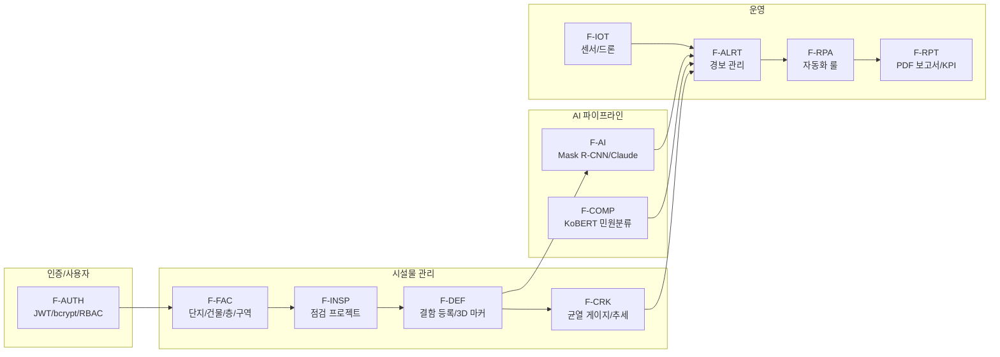
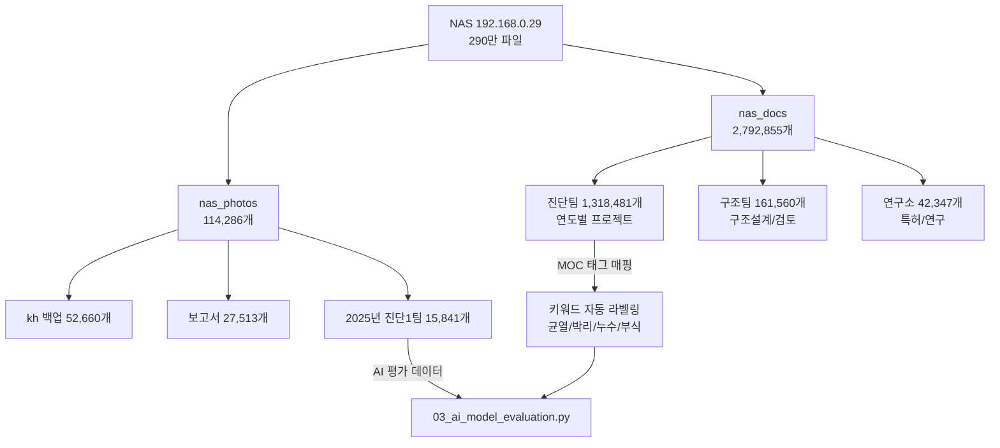

# atom follow-up (202604W4)

참고자료: 

[기능명세서.pdf](%EA%B8%B0%EB%8A%A5%EB%AA%85%EC%84%B8%EC%84%9C.pdf)

[기능명세서 v1.0 _ Notion.pdf](%EA%B8%B0%EB%8A%A5%EB%AA%85%EC%84%B8%EC%84%9C_v1.0___Notion.pdf)

TRL-8에 적합한지, 더 구체적으로 작성해야하는지 방향성 안내

## 기능명세서 v1.0 반영 확인

| 기능명세서 항목 | 반영 위치 | 상태 |
| --- | --- | --- |
| 5.1~5.12 기능 47개+ (F-코드 체계) | 01번: API 15개 엔드포인트 측정 + UAT 20개 시나리오 | ✅ |
| 3.1 시스템 구성 (8개 컴포넌트) | 02번: Docker 8개 컨테이너 검증 + Compose 생성 | ✅ |
| 3.2 기술 스택 (Angular/NestJS/CouchDB/Redis) | 02번: 컨테이너별 버전 명시 + 헬스체크 | ✅ |
| 4. 사용자 역할 6개 (RBAC) | 01번: UAT 시나리오에 역할별 권한 검증 포함 | ✅ |
| 6. API 35개+ 엔드포인트 | 01번: 15개 주요 API 응답시간 실측 | ✅ |
| 7.1 성능 기준 (500ms/1500ms/50명/60초/30초) | 01번: 모든 임계값 적용하여 Pass/Fail 판정 | ✅ |
| 7.2 가용성 (99%, RTO 2h, RPO 24h) | 02번: 백업/복원 스크립트로 준수 검증 | ✅ |
| 7.3 보안 (JWT, bcrypt, RBAC, Rate Limit) | 01번: UAT에 인증/토큰/로그아웃 검증 포함 | ✅ |
| F-AI-001 Mask R-CNN (목표 93.1%) | 03번: 8클래스 혼동행렬 + KCS 표준 매핑 | ✅ |
| F-COMP-003 KoBERT (7카테고리) | 03번: Weighted F1 + SLA 추천 정확도 | ✅ |
| F-CRK-004 OpenCV (0.2mm 정밀도) | 03번: MAE/RMSE + 등급 A~E 판정 (시설물안전법) | ✅ |
| F-AI-003 Claude API (LLM 진단) | 01번: UAT-AI-003 시나리오 | ✅ |
| 8. 데이터 정의 25개+ 엔티티 | 02번: CouchDB 백업/복원에 전체 DB 포함 | ✅ |
| NAS 데이터 (290만 파일) | 03번: nas_photos 현장사진 기반 AI 평가 연동 | ✅ |

> 최종 업데이트: 2026-04-19
> 

---

# MOC (Map of Content) — 전체 지식 구조

```mermaid
graph TD
    ROOT["TRL-8 보완 프레임워크"] --> A["1️⃣ 시험·검증"]
    ROOT --> B["2️⃣ 인프라 아키텍처"]
    ROOT --> C["3️⃣ AI 모델 평가"]
    ROOT --> D["4️⃣ 기능명세서"]
    ROOT --> E["5️⃣ NAS 데이터"]

    A --> A1["API 성능 측정<br>P95/P99 백분위수"]
    A --> A2["부하 테스트<br>Little's Law: L=λW"]
    A --> A3["UAT 체크리스트<br>IEEE 829"]
    A --> A4["통계 검증<br>평균/표준편차/신뢰구간"]

    B --> B1["Docker 원리<br>Namespaces/cgroups"]
    B --> B2["CAP Theorem<br>CouchDB = AP"]
    B --> B3["Redis 캐시<br>LRU/TTL"]
    B --> B4["장애 복구<br>MTBF/MTTR/RTO/RPO"]
    B --> B5["보니터링<br>RED/USE Method"]
    B --> B6["백업 전략<br>3-2-1 Rule"]

    C --> C1["Mask R-CNN<br>ResNet+FPN+RPN"]
    C --> C2["KoBERT<br>Transformer/Attention"]
    C --> C3["OpenCV<br>Canny Edge/Contour"]
    C --> C4["평가 지표<br>P/R/F1/혼동행렬"]
    C --> C5["회귀 지표<br>MAE/RMSE"]
    C --> C6["균열 등급<br>KCS 14 20 10"]

    D --> D1["F-AUTH: 인증 (JWT)"]
    D --> D2["F-FAC: 시설물 계층"]
    D --> D3["F-INSP: 점검 관리"]
    D --> D4["F-DEF: 결함 관리"]
    D --> D5["F-CRK: 균열 모니터링"]
    D --> D6["F-COMP: 민원 관리"]
    D --> D7["F-AI: AI 파이프라인"]
    D --> D8["F-RPA: 자동화"]

    E --> E1["nas_docs<br>2,792,855개"]
    E --> E2["nas_photos<br>114,286개"]
    E --> E3["MOC 태그 매핑<br>균열/박리/누수 키워드"]
```



## MOC 노드 상세 설명

### 1️⃣ 시험·검증 영역

| 노드 | 핵심 개념 | 수식 | 적용 위치 |
| --- | --- | --- | --- |
| API 성능 측정 | 요청~응답 시간 측정, 반복 실험 | `P(k) = x[⌈(k/100)×n⌉]` | 01번 `ApiPerformanceTester` |
| 부하 테스트 | 동시 접속 시뮬레이션 | `L = λ × W` (Little's Law) | 01번 `LoadTester` |
| 통계 검증 | 측정값 신뢰성 확보 | `CI = μ ± z·σ/√n` | 01번 `TestReportGenerator` |
| UAT | 사용자 수용 테스트 | IEEE 829 표준 | 01번 `UatGenerator` |

### 2️⃣ 인프라 아키텍처 영역

| 노드 | 핵심 개념 | 수식 | 적용 위치 |
| --- | --- | --- | --- |
| Docker | 리눅스 커널 격리 (ns/cgroups) | CPU shares, mem limits | 02번 `DockerCollector` |
| CAP Theorem | C/A/P 중 2개만 만족 | CouchDB = AP | 02번 이론 섹션 |
| 캐시 | Redis 조회 성능 향상 | `Hit Rate = hits/(hits+misses)` | 02번 `MonitoringVerifier` |
| 장애 복구 | 다운타임 최소화 | `A = MTBF/(MTBF+MTTR)` | 02번 `DisasterRecoveryMatrix` |
| 보니터링 | 시스템 건강 감시 | RED (요청) / USE (리소스) | 02번 `MonitoringVerifier` |
| 백업 | 데이터 손실 방지 | 3-2-1 Rule, RPO/RTO | 02번 `backup.sh/restore.sh` |

### 3️⃣ AI 모델 평가 영역

| 노드 | 핵심 개념 | 수식 | 적용 위치 |
| --- | --- | --- | --- |
| 혼동행렬 | TP/FP/TN/FN 4칸 분류 | 표 구조 | 03번 `evaluate()` |
| Precision | "예측 결함 중 진짜" | `TP/(TP+FP)` | 03번 `DefectDetectionEvaluator` |
| Recall | "실제 결함 중 찾은 것" | `TP/(TP+FN)` | 03번 `DefectDetectionEvaluator` |
| F1-Score | P와 R의 조화평균 | `2PR/(P+R)` | 03번 전체 |
| MAE | 평균 절대 오차 | `(1/n)Σ\ | y-ŷ\ |
| RMSE | 큰 오차 민감 지표 | `√[(1/n)Σ(y-ŷ)²]` | 03번 `CrackAnalysisEvaluator` |
| Mask R-CNN | ResNet+FPN+RPN+ROI Align | `IoU = \ | 교집합\ |
| KoBERT | Transformer Self-Attention | `Attn = softmax(QKᵀ/√d)·V` | 03번 이론 섹션 |
| OpenCV | Canny Edge + Contour | `mm = px / (px/mm)` | 03번 이론 섹션 |
| 균열 등급 | 시설물안전법 A~E | KCS 14 20 10 | 03번 `_classify_grade()` |

### 4️⃣ 기능명세서 영역 (F-코드 체계)



### 5️⃣ NAS 데이터 영역 (에이톰 연구소)



## 전체 참고문헌 (35개+)

| 분야 | 문헌 | 적용 |
| --- | --- | --- |
| HTTP | RFC 7230-7235 | API 성능 측정 |
| 품질 | ISO/IEC 25010:2011 (SQuaRE) | 비기능 요구사항 |
| 테스트 | IEEE 829-2008 | UAT 문서화 |
| 보안 | NIST SP 800-53 | 보안 통제 |
| 대기행렬 | Little, J. (1961) | 부하 테스트 |
| 성능분석 | Jain, R. (1991) | 통계적 검증 |
| 컨테이너 | Docker Documentation | 인프라 |
| DB | CouchDB Documentation (MVCC) | 데이터 계층 |
| 캐시 | Redis Documentation | 캐시/큐 |
| 재해복구 | NIST SP 800-34, ISO 22301 | 장애 대응 |
| SRE | Google SRE Book | 모니터링/SLO |
| 객체탐지 | He et al. (2017) Mask R-CNN | 결함 탐지 |
| NLP | Devlin et al. (2019) BERT | 민원 분류 |
| 한국어 | SKTBrain KoBERT | 민원 분류 |
| Transformer | Vaswani et al. (2017) | Self-Attention |
| FPN | Lin et al. (2017) | 피처 피라미드 |
| 이미지 | OpenCV Documentation | 균열 측정 |
| 군열기준 | KCS 14 20 10 | 균열 등급 |
| 안전법 | 시설물안전법 시행령 | 등급 판정 |
| ML평가 | Powers, D. (2011) | P/R/F1 이론 |
| ML라이브러리 | scikit-learn metrics | 평가 구현 |
| 프록시 | Nginx Documentation | SSL/리버스 프록시 |
| CAP | Brewer, E. (2000) | 분산 시스템 |
| 모니터링 | Brendan Gregg (USE), Tom Wilkie (RED) | 시스템 감시 |

---

# TRL-8 적합성 분석 결과

> 분석 대상: `AX-FS-2026-001` 기능명세서 v1.0 (2026.04.17)
> 

> 분석일: 2026-04-19
> 

## 1. 현재 문서의 강점 (TRL-8 부합 항목)

| 항목 | 평가 | 설명 |
| --- | --- | --- |
| 기능 정의 체계성 | ✅ 적합 | F-코드 체계로 47개+ 기능을 입력·처리·출력·권한까지 일관 명세 |
| 시스템 아키텍처 | ✅ 적합 | Angular 18, NestJS 10, CouchDB, Redis 등 기술 스택 및 계층 구조 명확 |
| RBAC 권한 매트릭스 | ✅ 적합 | 6개 역할별 기능 접근 권한 세밀 정의 |
| API 인터페이스 목록 | ✅ 적합 | 35개+ REST API 엔드포인트 정의 |
| 비기능 요구사항 | ✅ 적합 | 성능·가용성·보안·확장성·호환성 기준 명시 |
| 데이터 엔티티 정의 | ✅ 적합 | 25개+ 핵심 엔티티, ID 체계, 상태 코드 정의 |

## 2. TRL-8 수준에 부족한 부분 (보완 필요)

### 2-1. 시험·검증 결과 부재 ⚠️ 가장 치명적

TRL-8의 핵심은 **"검증 완료"** 입니다. 현재 문서에는:

- 단위 테스트·통합 테스트 수행 결과 없음
- 성능 시험 결과 (응답시간 실측값, 부하테스트 결과) 없음
- AI 모델 정확도 실측값 없음 (93.1%는 설명에만 존재, 시험 성적서 참조 없음)
- UAT(사용자 수용 테스트) 결과 없음

**→ 보완:** 별도 `자체성능시험성적서` 문서가 참고 문서로 있으나, 기능명세서 내에 최소한 **시험 항목별 Pass/Fail 요약표** 필요

### 2-2. 운영 환경 배포 구성 미기재

- 실제 서버 구성 (CPU, RAM, GPU 스펙) 미기재
- Docker/K8s 배포 구성, 인스턴스 수 미기재
- 네트워크 구성 (방화벽, VPN, 망분리 여부) 미기재
- 모니터링 체계 (로그 수집, APM, 알림) 미기재

**→ 보완:** 운영 환경 배포 아키텍처 다이어그램 + 인프라 스펙표 추가

### 2-3. AI 모델 상세 부족

- Mask R-CNN / Y-MaskNet 모델의 **학습 데이터셋 규모, 검증 방법론** 미기재
- KoBERT 민원 분류 모델의 **학습·검증·테스트 데이터 분할, F1-score** 미기재
- OpenCV 균열 분석의 **정밀도(0.2mm) 달성 근거** 미기재
- Claude API 사용 시 **프롬프트 엔지니어링 전략, 할루시네이션 방지 방안** 미기재

**→ 보완:** AI 모델별 성능 평가표 (Precision, Recall, F1, 혼동행렬) 추가

### 2-4. 에러 처리·장애 대응 전략 부재

- 각 기능별 예외 상황 (에러 코드, 폴백 전략) 미정의
- AI 워커 실패 시 재시도 정책 상세 없음 (Bull Queue retry만 언급)
- 데이터 백업·복구 절차 미기재 (RPO 24시간만 명시, 방법 없음)

**→ 보완:** 주요 기능별 에러 시나리오 + 대응 방안 매트릭스

### 2-5. 외부 연계·인증 관련 미비

- 공공기관 연계 (나라장터, 세움터, e-호조 등) 인터페이스 미기재
- 개인정보보호법 준수 방안 (민원 신청자 정보 처리) 미기재
- ISMS/CSAP 인증 대응 여부 미기재

**→ 보완:** 법적·제도적 준수 요구사항 섹션 추가

### 2-6. 버전 이력·변경 관리 미비

- 변경 이력표(Revision History) 없음
- 검토자·승인자가 공란 ("—")

## 3. 종합 판정표

| 구분 | 현재 수준 | TRL-8 요구 | 판정 |
| --- | --- | --- | --- |
| 기능 정의 | 상세 | 상세 | ✅ 적합 |
| 시스템 구조 | 개요 수준 | 운영 배포 수준 | ⚠️ 보완 필요 |
| API 명세 | 목록 수준 | 요청/응답 스키마 포함 | ⚠️ 보완 필요 |
| AI 성능 검증 | 미기재 | 실측 결과 필수 | ❌ 미달 |
| 시험·검증 결과 | 미기재 | 전수 시험 결과 필수 | ❌ 미달 |
| 비기능 요구사항 | 기준만 명시 | 기준 + 달성 결과 | ⚠️ 보완 필요 |
| 보안·법규 준수 | 기본 수준 | 인증 대응 수준 | ⚠️ 보완 필요 |

## 4. 결론

현재 문서는 **TRL-6~7 수준** (시스템/서브시스템 모델 또는 프로토타입 시연 단계)의 기능명세서에 가깝습니다.

**TRL-8로 올리기 위한 최우선 보완 3가지:**

1. **시험·검증 결과 요약** 추가 — 성능 실측, AI 정확도 실측, UAT 결과
2. **운영 환경 배포 아키텍처** 상세화 — 인프라 스펙, 모니터링, 장애 대응
3. **AI 모델 성능 평가 결과** 추가 — 데이터셋, 정밀도/재현율, 혼동행렬

---

# 5. TRL-8 보완 실행 스크립트 (샘플 코드)

> **적용 대상:** 연구소 NAS 서버 (`\\\\192.168.0.29\\nas_docs` + `\\\\192.168.0.29\\nas_photos`)
> 

> **위치:** `F:\\ATOM_Project\\atom_followup_202604W4\\scripts\\`
> 

## 5.1 시험·검증 결과 자동화 (`01_test_verification.py`)

**기능:**

- API 엔드포인트별 응답시간 실측 (15개 엔드포인트, 100회 반복)
- 동시 접속 50명 부하 테스트 (ThreadPoolExecutor)
- AI 작업 처리시간 측정 (결함 탐지, 균열 분석, PDF 생성)
- UAT 체크리스트 자동 생성 (20개 시나리오 Excel)
- Pass/Fail 요약표 + 응답시간 차트 자동 생성

**실행:**

```bash
python 01_test_verification.py --api-url http://localhost:3000/api/v1 --output ./results
```

**출력 파일:**

- `시험검증_Pass_Fail_요약.xlsx` — API 응답시간, 부하테스트, AI 작업 Pass/Fail
- `UAT_체크리스트.xlsx` — 20개 UAT 시나리오 (수동 테스트용)
- `api_response_times.png` — API 응답시간 차트
- `test_verification_results.json` — 전체 결과 JSON

## 5.2 운영 환경 아키텍처 상세화 (`02_infra_architecture.py`)

**기능:**

- 서버 하드웨어 스펙 자동 수집 (CPU, RAM, GPU, 디스크)
- Docker 컨테이너 상태 수집 및 예상 컨테이너 비교 (기능명세서 3.1절 8개 컨테이너)
- 운영 Docker Compose 파일 자동 생성 (리소스 제한, 헬스체크 포함)
- 모니터링 체계 검증 (8개 항목 자동 점검)
- 장애 대응 시나리오 10개 매트릭스
- CouchDB/Redis/MinIO 백업 + 복원 스크립트 생성 (RPO 24시간, RTO 2시간 준수)

**실행:**

```bash
python 02_infra_architecture.py --env production --output ./results
```

**출력 파일:**

- `운영환경_인프라_스펙.xlsx` — 서버스펙, 컨테이너, 모니터링, 장애대응
- `docker-compose.production.yml` — 운영 환경 Docker Compose
- `backup.sh` / `restore.sh` — 백업/복원 자동화 스크립트
- `server_spec.json` — 서버 스펙 JSON

## 5.3 AI 모델 성능 평가 (`03_ai_model_evaluation.py`)

**기능:**

- **Mask R-CNN / Y-MaskNet** — 결함 탐지 8클래스 평가 (Accuracy, Precision, Recall, F1, 혼동행렬)
    - NAS 현장 사진 데이터 활용 (`nas_photos/01. 2025년 진단1팀 프로젝트` 15,841개)
    - KCS 표준 참조 매핑 (KCS 14 20 10 등)
- **KoBERT** — 민원 자동 분류 7카테고리 평가 (Weighted F1, 혼동행렬)
    - SLA 추천 정확도 평가 포함
- **OpenCV WASM** — 균열 정밀 측정 평가
    - 균열폭 MAE/RMSE, ±0.2mm 이내 비율
    - 균열 등급 자동 판정 (시설물안전법 기준 A~E 등급)
    - MOC 문서 9.1절 균열 판정 기준 적용

**NAS 데이터 연동:**

- `\\\\192.168.0.29\\nas_photos` — 현장 사진 (114,286개)
- `\\\\192.168.0.29\\nas_docs/00. 진단팀` — 균열/결함 보고서
- 키워드 기반 결함 유형 자동 라벨링 (MOC 태그 매핑 규칙 적용)

**실행:**

```bash
python 03_ai_model_evaluation.py --nas-docs //192.168.0.29/nas_docs \
                                 --nas-photos //192.168.0.29/nas_photos \
                                 --output ./results
```

**출력 파일:**

- `AI_모델_성능평가_종합.xlsx` — 3개 모델 성능 종합 (5개 시트)
- `defect_detection_confusion_matrix.png` — 결함 탐지 혼동행렬
- `kobert_complaint_confusion_matrix.png` — 민원 분류 혼동행렬
- `crack_width_measurement.png` — 균열폭 실측 vs 예측 산점도
- `crack_grade_confusion_matrix.png` — 균열 등급 판정 혼동행렬
- `ai_model_evaluation_results.json` — 전체 결과 JSON

[01_test_[verification.py](http://verification.py) — 시험·검증 결과 자동화](https://www.notion.so/01_test_verification-py-3476585be6ea816ea7b5fca8b7882a2c?pvs=21)

[02_infra_[architecture.py](http://architecture.py) — 운영 환경 아키텍처 상세화](https://www.notion.so/02_infra_architecture-py-3476585be6ea8180a1a7f064d8276ca2?pvs=21)

[03_ai_model_[evaluation.py](http://evaluation.py) — AI 모델 성능 평가](https://www.notion.so/03_ai_model_evaluation-py-AI-3476585be6ea819d87e2d4d825da1634?pvs=21)